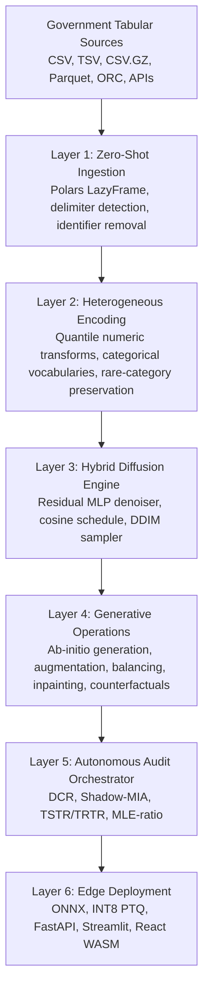
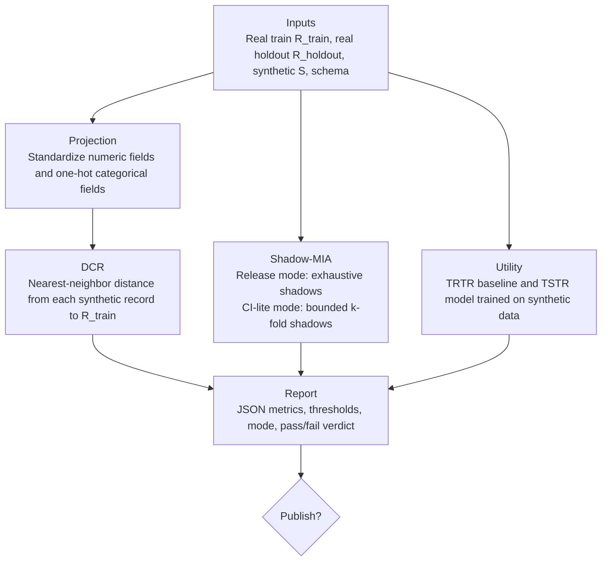

# DATALUS: Diffusion-Augmented Tabular Architecture for Local Utility and Security

> 🇧🇷 **Atenção Comissão Julgadora do 32º Prêmio Jovem Cientista:** A documentação oficial, elaborada com o rigor científico exigido pelo edital e detalhando o impacto na LGPD e em políticas públicas, encontra-se no arquivo [README_pt-BR.md](./README_pt-BR.md).

DATALUS is a production-oriented Generative AI framework for synthetic tabular data. It is designed for high-dimensional, heterogeneous, privacy-sensitive government datasets, with a specific proof-of-concept path for Brazilian public-sector health data. The system learns a joint distribution over tabular records, samples new microdata from that distribution, and subjects generated artifacts to reproducible privacy and utility audits before release.

DATALUS is not an anonymization script. It is a generative ecosystem for ab-initio synthesis, data augmentation, minority-class balancing, tabular inpainting, counterfactual modification, audit automation, ONNX export, INT8 edge inference, FastAPI artifact serving, Streamlit operation, and browser-local execution through ONNX Runtime Web.

## Table of Contents

- [Research and Public Data Context](#research-and-public-data-context)
- [System Requirements](#system-requirements)
- [Architecture](#architecture)
- [Generative Capabilities](#generative-capabilities)
- [Mathematical Foundation](#mathematical-foundation)
- [Autonomous Audit Orchestrator](#autonomous-audit-orchestrator)
- [Installation and Developer Setup](#installation-and-developer-setup)
- [Complete CLI Cheatsheet](#complete-cli-cheatsheet)
- [Training Lifecycle and Colab Constraints](#training-lifecycle-and-colab-constraints)
- [Inference and Model Architecture Details](#inference-and-model-architecture-details)
- [FastAPI Artifact Service](#fastapi-artifact-service)
- [Docker Deployment](#docker-deployment)
- [CI/CD and Automated Testing](#cicd-and-automated-testing)
- [Data Governance, Ethics, and LGPD Alignment](#data-governance-ethics-and-lgpd-alignment)
- [Troubleshooting and FAQ](#troubleshooting-and-faq)
- [References](#references)
- [License](#license)
- [Citation](#citation)

## Research and Public Data Context

Brazil's open-data policy is coordinated through the Infraestrutura Nacional de Dados Abertos (INDA), and [dados.gov.br](https://dados.gov.br) is the central catalog for public datasets. Government sources publish data across CSV, JSON, XML, ODS, RDF, APIs, Parquet-like analytic exports, and sector-specific repositories. The practical result is schema heterogeneity: inconsistent delimiters, lossy encodings, sparse columns, high-cardinality codes, rare municipalities, rare diseases, changing field names, and mixed numeric/string representations.

DATALUS implements ingestion and encoding policies for that reality:

- Lazy Polars scans avoid full in-memory Pandas loading.
- CSV scans detect common delimiters and use lossy UTF-8 decoding for legacy encodings.
- Identifier-like fields are removed before modeling.
- Sparse and free-text columns are rejected by explicit policy.
- Observed rare categories are preserved as first-class tokens; only unseen inference-time values map to `__UNKNOWN__`.
- Category frequency metadata is serialized so downstream audits can detect long-tail collapse.

Primary public-data references:

- Brazilian open-data policy and dados.gov.br catalog: [Governo Digital Dados Abertos](https://www.gov.br/governodigital/pt-br/dados-abertos/dados-abertos), [Portal Brasileiro de Dados Abertos](https://www.gov.br/governodigital/pt-br/dados-abertos/portal-brasileiro-de-dados-abertos), [API Portal de Dados Abertos](https://www.gov.br/conecta/catalogo/apis/api-portal-de-dados-abertos).
- Tabular diffusion: [Kotelnikov et al., TabDDPM](https://arxiv.org/abs/2209.15421).
- RePaint inpainting: [Lugmayr et al.](https://arxiv.org/abs/2201.09865).
- Classifier-Free Guidance: [Ho and Salimans](https://arxiv.org/abs/2207.12598).
- DDIM sampling: [Song et al.](https://arxiv.org/abs/2010.02502).
- Membership inference attacks: [Shokri et al.](https://arxiv.org/abs/1610.05820).

## System Requirements

| Layer | Minimum | Recommended | Notes |
| --- | --- | --- | --- |
| Python | 3.11 | 3.11 or newer | The package metadata declares `requires-python >=3.11`. |
| Training GPU | CPU works for tests | NVIDIA T4 15 GB VRAM or better | Colab T4 is the target constrained GPU profile. |
| Training RAM | 8 GB | 16 GB or more | Lazy ingestion helps, but encoding and audit projection need memory. |
| Browser inference | Modern Chromium, Firefox, or Edge | Browser with WebAssembly and Cache API | The React component uses `onnxruntime-web` WASM locally. |
| Node.js | 20 in CI | 20 LTS | Frontend CI uses `actions/setup-node@v4` with Node 20. |
| Docker | Compose v2 | Docker Engine with Compose plugin | Compose starts the API and Streamlit containers. |

Optional dependency groups are declared in `pyproject.toml`:

| Extra | Purpose |
| --- | --- |
| `training` | PyTorch, ONNX, ONNX Runtime, ONNX Script. |
| `test` | Pytest and HTTPX for API tests. |
| `frontend` | Streamlit runtime. |
| `audit` | LightGBM and CatBoost for heavier audit experiments. |
| `dev` | Full local development stack. |

## Architecture

The codebase uses a strict `src/` layout and Clean Architecture boundaries:

```text
src/datalus/
  domain/            Framework-free schemas and diffusion schedule math
  infrastructure/    Polars, PyTorch, ONNX, checkpointing, encoding adapters
  application/       Training, inference, audit, and export use cases
  interfaces/        Typer CLI and FastAPI delivery adapters
frontend/
  streamlit/         Python Streamlit shell
  component/         React TypeScript ONNX Runtime Web component
tests/               Unit and integration tests
docker/              API and Streamlit Dockerfiles
.github/workflows/   CI jobs for Python, frontend, and Docker builds
```



### Clean Architecture Responsibilities

| Layer | Source path | Responsibility |
| --- | --- | --- |
| Domain | `src/datalus/domain` | Pydantic contracts, diffusion schedule math, RePaint config, privacy thresholds. |
| Infrastructure | `src/datalus/infrastructure` | Polars scanning, reversible encoders, PyTorch networks, diffusion tensors, checkpointing, ONNX export. |
| Application | `src/datalus/application` | Training, sampling, augmentation, balancing, inpainting, counterfactuals, auditing, artifact export. |
| Interfaces | `src/datalus/interfaces` | Typer CLI and FastAPI app. |
| Frontend | `frontend` | Streamlit shell and React ONNX Runtime Web component. |

## Generative Capabilities

DATALUS exposes distinct workflows because synthetic data systems have different operational goals:

| Capability | Purpose | CLI |
| --- | --- | --- |
| Ab-initio generation | Create a new synthetic dataset from learned distributions. | `datalus sample` |
| Data augmentation | Append synthetic rows to a small dataset. | `datalus augment` |
| Minority balancing | Generate records until target-class counts approach a requested distribution. | `datalus balance` |
| Tabular inpainting | Fill missing values while preserving observed fields at every reverse step. | `datalus inpaint` |
| Counterfactual modification | Apply column interventions and regenerate compatible records. | `datalus counterfactual` |
| Audit | Evaluate empirical privacy and predictive utility before release. | `datalus audit` |
| Edge export | Export EMA weights to ONNX and optional INT8. | `datalus export-onnx` |
| Artifact serving | Serve registry artifacts for browser-local inference. | `datalus serve` |

The current denoiser exposes CFG-compatible inference logic. In the default training path, models are instantiated without a context vector, so `cfg_scale=1.0` is the unconditional path and changing `cfg_scale` has no effect unless a context-enabled denoiser is introduced. The ONNX export path still records an INT8 CFG amplification parity guard at `cfg_scale=3.0` because quantization drift can become operationally relevant when guidance is enabled.

## Mathematical Foundation

### Implemented Cosine Schedule

The domain layer implements the Nichol-Dhariwal cosine schedule with numerical clipping. For training horizon $T$ and offset $s=0.008$:

$$
f(t)=\cos^2\left(\frac{t/T+s}{1+s}\frac{\pi}{2}\right)
$$

The normalized cumulative product is:

$$
\bar{\alpha}_t=\frac{f(t)}{f(0)}
$$

The beta schedule is:

$$
\beta_t=\text{clip}\left(1-\frac{\bar{\alpha}_{t+1}}{\bar{\alpha}_t},10^{-5},0.999\right)
$$

`VarianceSchedule` converts these values into tensors for $\beta_t$, $\alpha_t=1-\beta_t$, $\bar{\alpha}_t$, $\sqrt{\bar{\alpha}_t}$, and $\sqrt{1-\bar{\alpha}_t}$. A linear beta schedule also exists for ablation and tests.

### Forward Markov Chain

For a latent tabular vector $\mathbf{x}_0\in\mathbb{R}^d$, the DDPM forward process corrupts the sample through a Markov chain:

$$
q(\mathbf{x}_t\mid\mathbf{x}_{t-1})=\mathcal{N}\left(\mathbf{x}_t;\sqrt{1-\beta_t}\mathbf{x}_{t-1},\beta_t\mathbf{I}\right)
$$

With $\alpha_t=1-\beta_t$ and $\bar{\alpha}_t=\prod_{s=1}^{t}\alpha_s$, the closed-form marginal is:

$$
q(\mathbf{x}_t\mid\mathbf{x}_0)=\mathcal{N}\left(\mathbf{x}_t;\sqrt{\bar{\alpha}_t}\mathbf{x}_0,(1-\bar{\alpha}_t)\mathbf{I}\right)
$$

The implemented `q_sample` tensor operation is:

$$
\mathbf{x}_t=\sqrt{\bar{\alpha}_t}\mathbf{x}_0+\sqrt{1-\bar{\alpha}_t}\boldsymbol{\epsilon},\quad\boldsymbol{\epsilon}\sim\mathcal{N}(\mathbf{0},\mathbf{I})
$$

### Reverse Process and Implemented Objective

The denoiser $\boldsymbol{\epsilon}_{\theta}$ predicts the injected noise. The probabilistic DDPM reverse process is:

$$
p_{\theta}(\mathbf{x}_{t-1}\mid\mathbf{x}_t)=\mathcal{N}\left(\mathbf{x}_{t-1};\boldsymbol{\mu}_{\theta}(\mathbf{x}_t,t),\boldsymbol{\Sigma}_{\theta}(\mathbf{x}_t,t)\right)
$$

DATALUS implements the simplified epsilon-prediction objective used by `TabularDiffusion.compute_loss`:

$$
\mathcal{L}_{\mathrm{MSE}}=\mathbb{E}_{t,\mathbf{x}_0,\boldsymbol{\epsilon}}\left[\left\lVert\boldsymbol{\epsilon}-\boldsymbol{\epsilon}_{\theta}\left(\sqrt{\bar{\alpha}_t}\mathbf{x}_0+\sqrt{1-\bar{\alpha}_t}\boldsymbol{\epsilon},t\right)\right\rVert_2^2\right]
$$

For categorical-logit extensions, the intended TabDDPM composite objective is:

$$
\mathcal{L}_{\mathrm{total}}=\lambda_{\mathrm{num}}\mathcal{L}_{\mathrm{MSE}}^{\mathrm{num}}+\lambda_{\mathrm{cat}}\mathcal{L}_{\mathrm{CE}}^{\mathrm{cat}}
$$

The current implementation projects categorical values into continuous learned embedding slices and trains the diffusion model with the MSE objective over the full latent vector. It does not currently train a separate categorical cross-entropy head.

### DDIM Sampling

`make_ddim_timesteps` returns a descending deterministic subsequence from the training horizon. In each reverse step, `ddim_step` first computes:

$$
\hat{\mathbf{x}}_0=\frac{\mathbf{x}_t-\sqrt{1-\bar{\alpha}_t}\boldsymbol{\epsilon}_{\theta}(\mathbf{x}_t,t)}{\sqrt{\bar{\alpha}_t}}
$$

When $\eta>0$, the implemented stochastic variance term is:

$$
\sigma_t=\eta\sqrt{\left(\frac{1-\bar{\alpha}_{t-1}}{1-\bar{\alpha}_t}\right)\left(1-\frac{\bar{\alpha}_t}{\bar{\alpha}_{t-1}}\right)}
$$

The update is:

$$
\mathbf{x}_{t-1}=\sqrt{\bar{\alpha}_{t-1}}\hat{\mathbf{x}}_0+\sqrt{1-\bar{\alpha}_{t-1}-\sigma_t^2}\boldsymbol{\epsilon}_{\theta}(\mathbf{x}_t,t)+\sigma_t\boldsymbol{\epsilon}
$$

In the default CLI path, $\eta=0$, so $\sigma_t=0$ and sampling is deterministic for a fixed seed. The final implementation convention treats `prev_t=-1` as $\bar{\alpha}_{-1}=1$.

### Classifier-Free Guidance

When context is provided, DATALUS combines unconditional and conditional noise predictions:

$$
\tilde{\boldsymbol{\epsilon}}_{\theta}(\mathbf{x}_t,\mathbf{c},t)=\boldsymbol{\epsilon}_{\theta}(\mathbf{x}_t,\varnothing,t)+w\left[\boldsymbol{\epsilon}_{\theta}(\mathbf{x}_t,\mathbf{c},t)-\boldsymbol{\epsilon}_{\theta}(\mathbf{x}_t,\varnothing,t)\right]
$$

The implementation returns the direct denoiser prediction when `context is None` or `cfg_scale == 1.0`. Group guidance is implemented as a mask-and-scale extension over context dimensions.

### RePaint Tabular Inpainting

For a known-value mask $\mathbf{m}$, observed coordinates are re-noised during the reverse process:

$$
\mathbf{x}_{t}^{\mathrm{known}}=\sqrt{\bar{\alpha}_t}\mathbf{x}_0^{\mathrm{known}}+\sqrt{1-\bar{\alpha}_t}\boldsymbol{\epsilon}
$$

Unknown coordinates are produced by DDIM, and known coordinates are restored by latent-space fusion:

$$
\mathbf{x}_t=\mathbf{m}\odot\mathbf{x}_{t}^{\mathrm{known}}+(1-\mathbf{m})\odot\mathbf{x}_{t}^{\mathrm{generated}}
$$

The implemented jump-back step reintroduces noise from `from_t` to `to_t`:

$$
\mathbf{x}_{\mathrm{jump}}=\sqrt{\frac{\bar{\alpha}_{\mathrm{to}}}{\bar{\alpha}_{\mathrm{from}}}}\mathbf{x}_{\mathrm{from}}+\sqrt{1-\frac{\bar{\alpha}_{\mathrm{to}}}{\bar{\alpha}_{\mathrm{from}}}}\boldsymbol{\epsilon}
$$

`make_repaint_schedule` creates the reverse schedule plus forward jumps. The CLI exposes `--jump-length` and `--jump-n-sample`.

## Autonomous Audit Orchestrator



### Projection Space

The OAA projects real and synthetic records into a common sklearn feature space. Numerical columns are standardized. Categorical and boolean columns are one-hot encoded with `handle_unknown="ignore"`. Dropped columns, target columns, and columns absent from either frame are excluded from privacy projection.

### Distance to Closest Record

For each synthetic record $\hat{\mathbf{x}}_i$, DATALUS computes the nearest-neighbor distance to the projected real training data:

$$
\mathrm{DCR}(\hat{\mathbf{x}}_i)=\min_{j\in\{1,\ldots,N\}}d(\hat{\mathbf{x}}_i,\mathbf{x}_j^{\mathrm{real}})
$$

The alert threshold is the configured percentile of each real record's second-nearest real neighbor distance:

$$
\tau_{\mathrm{DCR}}=\text{percentile}_{p}\left(\{d_2(\mathbf{x}_j^{\mathrm{real}},R_{\mathrm{train}})\}_{j=1}^{N}\right)
$$

The memorization ratio is:

$$
\rho_{\mathrm{mem}}=\frac{1}{M}\sum_{i=1}^{M}\mathbf{1}\left[\mathrm{DCR}(\hat{\mathbf{x}}_i)<\tau_{\mathrm{DCR}}\right]
$$

The default approval rule is $\rho_{\mathrm{mem}}<0.01$ with the DCR threshold percentile $p=1.0$.

### Shadow-Model Membership Inference

Following the Shokri threat model, the attacker learns features that distinguish records used to train a generator from non-member records. DATALUS computes nearest-neighbor attack features for candidate records against generated records:

$$
\phi(\mathbf{x})=\left[d_{\min}(\mathbf{x},S),\overline{d}_k(\mathbf{x},S),\text{std}_k(\mathbf{x},S),\frac{d_{\min}(\mathbf{x},S)}{\max(\overline{d}_k(\mathbf{x},S),10^{-8})}\right]
$$

A RandomForest attack model estimates membership scores. The central metric is attack ROC-AUC:

$$
\mathrm{AUC}_{\mathrm{MIA}}=\Pr\left(s_{\mathrm{member}}>s_{\mathrm{nonmember}}\right)
$$

`release` mode uses the uncapped `ShadowMIAConfig`. `ci_lite` applies deterministic caps: at most two shadow models, synthetic multiplier at most `0.5`, at most three neighbors, default maximum of 512 rows, at most 50 attack estimators, maximum depth 6, and minimum leaf size at least 2. `ci_lite` is a regression check for CI/CD, not a release audit.

### MLE-Ratio Utility

Utility is measured by Train on Synthetic, Test on Real (TSTR) against a Train on Real, Test on Real (TRTR) baseline:

$$
\mathrm{MLE}_{\mathrm{ratio,AUC}}=\frac{\mathrm{AUC}_{\mathrm{TSTR}}}{\mathrm{AUC}_{\mathrm{TRTR}}}
$$

The implementation also reports:

$$
\mathrm{MLE}_{\mathrm{ratio,F1}}=\frac{\mathrm{F1}_{\mathrm{TSTR}}}{\mathrm{F1}_{\mathrm{TRTR}}}
$$

The default utility approval threshold is $\mathrm{MLE}_{\mathrm{ratio,AUC}}\geq0.90$.

## Installation and Developer Setup

### Python Environment

Python 3.11 or newer is required. Use a local virtual environment rather than installing into externally managed system Python:

```bash
python -m venv .venv
.venv/bin/python -m pip install --upgrade pip
.venv/bin/python -m pip install -e '.[dev]'
```

For lighter roles:

```bash
.venv/bin/python -m pip install -e '.[training,test]'
.venv/bin/python -m pip install -e '.[frontend]'
```

`requirements.txt` is a compatibility shim generated from `pyproject.toml`; the authoritative dependency source is `pyproject.toml`.

### Frontend Component

The Streamlit shell embeds the React component from `frontend/component/dist` when built. If the bundle is absent, the Python wrapper points to the Vite dev server at `http://localhost:5173`.

```bash
cd frontend/component
npm ci
npm run test
npm run build
```

For interactive component development:

```bash
cd frontend/component
npm run dev
```

Then launch Streamlit separately:

```bash
.venv/bin/datalus streamlit
```

### Local Verification

```bash
.venv/bin/python -m pytest -q
cd frontend/component
npm run test
npm run build
```

## Complete CLI Cheatsheet

The Command Line Interface (CLI) is implemented with Typer in `src/datalus/interfaces/cli.py`. It is deliberately thin: commands translate user input into application use cases and print file locations.

### End-to-End Workflow

```bash
datalus ingest raw.csv artifacts/demo/processed.parquet --schema-path artifacts/demo/schema_config.json --target-column target
datalus train artifacts/demo/schema_config.json artifacts/demo/processed.parquet artifacts/demo --epochs 5 --batch-size 2048
datalus sample artifacts/demo/checkpoints/checkpoint_latest.pt artifacts/demo/encoder_config.json artifacts/demo/synthetic.parquet --n-records 10000 --ddim-steps 50 --cfg-scale 1.0
datalus augment artifacts/demo/checkpoints/checkpoint_latest.pt artifacts/demo/encoder_config.json small.parquet artifacts/demo/augmented.parquet --n-records 5000
datalus balance artifacts/demo/checkpoints/checkpoint_latest.pt artifacts/demo/encoder_config.json train.parquet artifacts/demo/balanced.parquet target '{"0": 5000, "1": 5000}'
datalus inpaint artifacts/demo/checkpoints/checkpoint_latest.pt artifacts/demo/encoder_config.json incomplete.parquet artifacts/demo/inpainted.parquet
datalus counterfactual artifacts/demo/checkpoints/checkpoint_latest.pt artifacts/demo/encoder_config.json records.parquet artifacts/demo/counterfactual.parquet '{"municipality": "3550308"}'
datalus audit real_train.parquet artifacts/demo/synthetic.parquet artifacts/demo/schema_config.json artifacts/demo/audit_report.json --target-column target --mia-mode release
datalus export-onnx artifacts/demo/checkpoints/checkpoint_latest.pt artifacts/demo/encoder_config.json artifacts/demo --quantize
datalus serve artifacts --host 0.0.0.0 --port 8000
```

### Command Summary

| Command | Purpose | Primary output |
| --- | --- | --- |
| `ingest` | Infer schema and stream retained data to Parquet. | `schema_config.json`, processed Parquet. |
| `train` | Train the diffusion model with deterministic checkpoints. | `encoder_config.json`, `checkpoints/checkpoint_latest.pt`. |
| `sample` | Generate an ab-initio synthetic dataset. | Synthetic Parquet. |
| `augment` | Append synthetic records to an existing Parquet dataset. | Augmented Parquet. |
| `balance` | Generate records for requested class counts. | Balanced Parquet. |
| `inpaint` | Fill null values using RePaint-style masks. | Inpainted Parquet. |
| `counterfactual` | Apply do-style interventions and regenerate compatible fields. | Counterfactual Parquet. |
| `audit` | Run DCR and Shadow-MIA, and utility when target is valid. | Audit JSON report. |
| `export-onnx` | Export EMA denoiser to ONNX and optional INT8. | ONNX files and manifest JSON. |
| `serve` | Serve artifacts for browser-local inference. | FastAPI service. |
| `streamlit` | Launch the Portuguese Streamlit UI. | Streamlit service. |

### Command Arguments and Defaults

| Command | Positional arguments | Options and defaults | Expected output |
| --- | --- | --- | --- |
| `ingest` | `input_path`, `output_path` | `--schema-path artifacts/schema_config.json`, `--target-column None` | Prints schema and processed Parquet paths. Writes Snappy Parquet and schema metadata. |
| `train` | `schema_path`, `data_path`, `output_dir` | `--epochs 1`, `--batch-size 2048`, `--max-steps None`, `--resume-from None` | Prints checkpoint path. Writes `encoder_config.json` and checkpoints under `output_dir/checkpoints`. |
| `sample` | `checkpoint_path`, `encoder_path`, `output_path` | `--n-records 100`, `--ddim-steps 50`, `--seed 42`, `--cfg-scale 1.0` | Writes synthetic Parquet with Snappy compression. |
| `augment` | `checkpoint_path`, `encoder_path`, `input_path`, `output_path` | `--n-records 100`, `--ddim-steps 50`, `--seed 42`, `--cfg-scale 1.0` | Writes original rows plus synthetic rows selected to original columns. |
| `balance` | `checkpoint_path`, `encoder_path`, `input_path`, `output_path`, `target_column`, `target_distribution_json` | `--ddim-steps 50`, `--seed 42`, `--cfg-scale 1.0`, `--max-attempts 10`, `--strict False` | Writes Parquet approaching requested class counts. Raises if `--strict` and attempts are exhausted. |
| `inpaint` | `checkpoint_path`, `encoder_path`, `input_path`, `output_path` | `--ddim-steps 50`, `--jump-length 10`, `--jump-n-sample 10`, `--seed 42` | Writes Parquet with null-driven latent fields imputed. |
| `counterfactual` | `checkpoint_path`, `encoder_path`, `input_path`, `output_path`, `intervention_json` | `--ddim-steps 50`, `--seed 42` | Writes Parquet under fixed intervention columns. |
| `audit` | `real_train_path`, `synthetic_path`, `schema_path`, `report_path` | `--target-column None`, `--real-holdout-path None`, `--mia-mode release`, `--max-audit-rows None` | Writes privacy JSON and utility JSON when target exists in both datasets. |
| `export-onnx` | `checkpoint_path`, `encoder_path`, `output_dir` | `--quantize True` | Writes `model_fp32.onnx`, optional `model_int8.onnx`, `encoder_config.json`, `projector_config.json`, `manifest.json`. |
| `serve` | `registry_path` default `artifacts` | `--host 0.0.0.0`, `--port 8000` | Starts Uvicorn factory app with `DATALUS_REGISTRY_PATH`. |
| `streamlit` | None | None | Runs `streamlit run frontend/streamlit/app.py`. |

### Operational Notes by Command

- `ingest` supports `.csv`, `.tsv`, `.csv.gz`, `.tsv.gz`, `.parquet`, and `.orc`. ORC requires `pyarrow`.
- `ingest` uses delimiter sniffing for CSV, semicolon fallback for ambiguous Brazilian spreadsheet exports, `utf8-lossy` decoding, `infer_schema_length=10000`, `ignore_errors=True`, and `truncate_ragged_lines=True`.
- `ingest` drops sparse columns with null ratio above `0.95`, identifier-like names such as CPF/CNPJ/CNS/email/phone-like fields, free-text columns, and unsupported dtypes.
- The underlying `ZeroShotPreprocessor` defaults are `high_cardinality_threshold=50`, `sample_size=100000`, `rare_category_threshold=5`, and null tokens `""`, `NA`, `N/A`, `null`, `NULL`, and `None`. The target column is protected from the sparse and identifier drop rules.
- `train` currently exposes a subset of `TrainingConfig` on the CLI. Learning rate, weight decay, hidden dimensions, AMP, EMA, warmup, and maximum encoder fit rows are configured in `TrainingConfig` for programmatic use.
- `balance` treats JSON class labels as strings during matching, so numeric class labels should be represented as JSON object keys such as `{"0": 5000}`.
- `counterfactual` interventions must reference retained columns from the fitted encoder. Unknown categorical values map to `__UNKNOWN__`.
- `audit` reads Parquet eagerly. For large official release audits, run on a machine sized for the projected one-hot matrix.
- `serve` disables server-side PyTorch generation by default. It is intended to serve public artifacts to the browser-local ONNX runtime.

## Training Lifecycle and Colab Constraints

### Lifecycle

1. `ingest` creates a retained Parquet dataset and `schema_config.json`.
2. `DatalusTrainer` loads schema metadata and builds deterministic Parquet batch offsets.
3. `TabularEncoder` fits numeric quantile transforms and categorical vocabularies on up to `max_encoder_fit_rows=100000`.
4. `FeatureProjector` concatenates numeric latent slices and categorical embedding slices.
5. `TabularDenoiserMLP` predicts diffusion noise over the full latent vector.
6. `TabularDiffusion.compute_loss` samples random timesteps and optimizes the MSE epsilon objective.
7. AdamW updates diffusion and projector parameters.
8. Linear warmup is followed by cosine annealing to `eta_min=1e-6`.
9. AMP GradScaler is used on CUDA when `amp=True`.
10. Gradients are clipped to `max_grad_norm=1.0`.
11. EMA tracks diffusion parameters with decay `0.9999`.
12. Checkpoints persist training state for deterministic resume.

### Default Training Configuration

| Parameter | Default |
| --- | --- |
| `batch_size` | `2048` |
| `epochs` | `1` |
| `learning_rate` | `2e-4` |
| `weight_decay` | `1e-4` |
| `checkpoint_every_steps` | `500` |
| `seed` | `42` |
| `num_timesteps` | `1000` |
| `hidden_dims` | `(512, 1024, 1024, 512)` |
| `amp` | `True` |
| `condition_dropout` | `0.1` |
| `ema_decay` | `0.9999` |
| `warmup_steps` | `500` |
| `max_grad_norm` | `1.0` |
| `max_encoder_fit_rows` | `100000` |

### Deterministic Checkpointing

Checkpoints are written atomically where possible. Each checkpoint includes:

- Diffusion model state.
- Feature projector state.
- Optimizer state.
- Scheduler state.
- AMP scaler state.
- EMA shadow weights.
- Epoch, batch index, global step, latest loss, and loss history.
- Training config and SHA-256 config hash.
- Python, NumPy, Torch, and CUDA RNG states when CUDA is available.

Resume with:

```bash
datalus train artifacts/demo/schema_config.json artifacts/demo/processed.parquet artifacts/demo --epochs 20 --batch-size 1024 --resume-from artifacts/demo/checkpoints/checkpoint_latest.pt
```

### Google Colab T4 Guidance

Colab T4 sessions are useful for proof-of-concept training but should be treated as preemptible. Store artifacts on Google Drive:

```python
from google.colab import drive
drive.mount('/content/drive')
```

Recommended Drive layout:

```text
/content/drive/MyDrive/datalus/
  raw/
  processed/
  artifacts/
    datasus_sih/
      schema_config.json
      encoder_config.json
      checkpoints/
```

Install and smoke test:

```bash
python -m pip install --upgrade pip
python -m pip install -e '.[training,test]'
datalus train /content/drive/MyDrive/datalus/artifacts/datasus_sih/schema_config.json /content/drive/MyDrive/datalus/processed/train.parquet /content/drive/MyDrive/datalus/artifacts/datasus_sih --epochs 1 --batch-size 2048 --max-steps 20
```

Batch-size tuning for T4:

| Symptom | Action |
| --- | --- |
| CUDA OOM before first checkpoint | Retry with `--batch-size 1024`. |
| OOM after several steps | Resume from `checkpoint_latest.pt` and reduce to `512`. |
| OOM with very wide categorical embedding space | Reduce to `256`, reduce retained high-cardinality columns upstream, or train on a larger GPU. |
| Session interruption | Resume from the Drive checkpoint path. |

Learning-rate defaults are conservative for T4. If using much smaller batches, keep `2e-4` for initial experiments and compare loss curves before changing optimizer settings.

## Inference and Model Architecture Details

### Numerical Quantile Transformations

Each numerical column fits up to 1,000 empirical quantiles. Transform maps finite values into the unit quantile domain and then into `[-1, 1]`. Non-finite values use the training median fill value. Inverse transform clips generated values back to `[0, 1]` in quantile space and interpolates over the stored quantile table.

### Categorical Vocabulary and Embeddings

Each categorical column stores:

- `__UNKNOWN__` at index 0.
- `__NULL__` at index 1.
- All observed categories sorted after the sentinels.
- Frequency metadata and rare-category counts.

Observed rare categories remain first-class tokens. During inference, never-seen categories map to `__UNKNOWN__`. The projector embeds each categorical column with the default dimension `ceil(log2(cardinality))`, bounded below by 2.

### Residual MLP Denoiser

The implemented `TabularDenoiserMLP` topology is:

1. Sinusoidal timestep embedding with default dimension `128`.
2. MLP time projection to `dim_t * 4`.
3. Optional context projection when `context_dim` is configured.
4. Input projection from latent dimension to the first hidden dimension.
5. Residual MLP blocks with Linear, LayerNorm, timestep injection, SiLU, Dropout, Linear, LayerNorm, and residual projection when dimensions differ.
6. Final LayerNorm, SiLU, and Linear projection back to the latent dimension.
7. Zero initialization of final Linear weights and bias.

### Python Inference Lifecycle

`load_model_bundle` reconstructs the encoder, projector, denoiser, and diffusion wrapper from a checkpoint. It loads EMA weights only when `use_ema=True`, which is used by ONNX export. Sampling creates Gaussian latent noise, runs DDIM, splits the latent tensor into numerical and categorical slices, decodes numerical values by inverse quantile interpolation, and decodes categories by nearest learned embedding.

### Browser Inference Lifecycle

The React component operates without server-side PyTorch:

1. Streamlit passes schema, encoder, projector, manifest, seed, row count, DDIM steps, and precision choice.
2. The component downloads `model_int8.onnx` or `model_fp32.onnx` from the FastAPI artifact endpoint.
3. The browser Cache API stores the ONNX bytes under `datalus-onnx-artifacts`.
4. ONNX Runtime Web creates a WASM session with graph optimization enabled.
5. TypeScript initializes deterministic Gaussian noise with a seeded linear congruential generator and Box-Muller transform.
6. DDIM runs in the browser by repeatedly invoking the ONNX denoiser.
7. Numerical and categorical decoding uses `encoder_config.json` and `projector_config.json`.
8. Generated records are returned to Streamlit through `streamlit-component-lib`.

Current browser conditions include `precision`, which selects the artifact filename. The `guidanceScale` argument is passed through the component interface for forward compatibility, but the exported ONNX wrapper currently has no context input.

### ONNX and INT8 Artifacts

`export-onnx` writes:

```text
artifacts/<domain>/
  model_fp32.onnx
  model_int8.onnx
  encoder_config.json
  projector_config.json
  manifest.json
```

The ONNX graph uses inputs `x_t` and `timestep`, output `predicted_noise`, opset 17, and dynamic batch axes. INT8 uses ONNX Runtime dynamic quantization with QInt8 weights. The manifest includes FP32 parity and INT8 CFG amplification parity:

```json
{
  "cfg_scale": 3.0,
  "amplified_max_abs_diff": 0.012,
  "categorical_agreement": null,
  "passed": true,
  "atol": 0.2
}
```

Treat `passed: false` as a release blocker for INT8 artifacts. Use FP32 or retrain/re-export before publishing edge artifacts.

## FastAPI Artifact Service

Artifact serving is enabled by default. Server-side PyTorch generation is disabled unless `create_app(..., enable_server_generation=True)` is used programmatically.

```bash
datalus serve artifacts --host 0.0.0.0 --port 8000
```

Core endpoints:

| Endpoint | Method | Purpose |
| --- | --- | --- |
| `/health` | `GET` | Service status, uptime, registry path. |
| `/artifacts` | `GET` | Lists artifact domains under the registry. |
| `/artifacts/{domain}/manifest` | `GET` | Returns `manifest.json`. |
| `/artifacts/{domain}/schema` | `GET` | Returns `schema_config.json`. |
| `/artifacts/{domain}/{file_name}` | `GET` | Serves approved public artifact files. |
| `/audit/latest` | `GET` | Returns the newest `audit_report.json`. |
| `/generate` | `POST` | Server-side generation when explicitly enabled. |
| `/augment` | `POST` | Server-side augmentation when explicitly enabled. |
| `/balance` | `POST` | Server-side balancing when explicitly enabled. |
| `/inpaint` | `POST` | Server-side inpainting when explicitly enabled. |
| `/counterfactual` | `POST` | Server-side counterfactual generation when explicitly enabled. |

Allowed public artifact files are `model_fp32.onnx`, `model_fp16.onnx`, `model_int8.onnx`, `schema_config.json`, `encoder_config.json`, `projector_config.json`, `model_config.json`, `audit_report.json`, and `manifest.json`. Domain path traversal is rejected. CORS currently allows all origins with `GET` and `POST`, which is convenient for local artifact demos and must be tightened by the production reverse proxy or deployment boundary.

Example request contract:

```json
{
  "domain": "datasus_sih",
  "n_records": 1000,
  "ddim_steps": 50,
  "seed": 42,
  "cfg_scale": 1.0
}
```

If `/generate` returns `403`, the service is operating in the intended artifact-serving mode. Use browser ONNX inference or construct the app with server-side generation enabled in a trusted internal environment.

## Docker Deployment

The repository includes a two-service Compose deployment:

- `api`: FastAPI artifact service built from `docker/Dockerfile.api`.
- `streamlit`: Streamlit UI built from `docker/Dockerfile.streamlit`, including Node/NPM component build.

Expected local artifact layout:

```text
artifacts/
  datasus_sih/
    manifest.json
    schema_config.json
    encoder_config.json
    projector_config.json
    model_fp32.onnx
    model_int8.onnx
    audit_report.json
```

Start both services:

```bash
docker compose up --build
```

Port mappings and volumes:

| Service | Container command | Port mapping | Artifact volume |
| --- | --- | --- | --- |
| `api` | `uvicorn datalus.interfaces.api:app --host 0.0.0.0 --port 8000` | `8000:8000` | `./artifacts:/app/artifacts:ro` |
| `streamlit` | `streamlit run frontend/streamlit/app.py --server.address=0.0.0.0 --server.port=8501` | `8501:8501` | `./artifacts:/app/artifacts:ro` |

Environment variables:

| Variable | Service | Value in Compose |
| --- | --- | --- |
| `DATALUS_REGISTRY_PATH` | `api`, `streamlit` | `/app/artifacts` |
| `DATALUS_ARTIFACT_BASE_URL` | `streamlit` | `http://localhost:8000/artifacts` |

Production security note: although the API container listens on `0.0.0.0:8000` and Streamlit listens on `0.0.0.0:8501`, real public-sector production deployments must place both containers behind a reverse proxy such as NGINX or Traefik with HTTPS/TLS termination, access controls, request logging, and network segmentation. Synthetic sensitive-data artifacts still require controlled distribution and transport encryption.

## CI/CD and Automated Testing

GitHub Actions defines three jobs:

| Job | Runtime | Commands |
| --- | --- | --- |
| `python-tests` | Ubuntu, Python 3.11, CPU Torch | `pip install ".[training,test]"`, `pytest`. |
| `frontend-build` | Ubuntu, Node 20 | `npm install`, `npm run test`, `npm run build`. |
| `docker-build` | Ubuntu Docker | Build API and Streamlit images. |

Dependabot is configured for weekly devcontainer updates. The devcontainer uses Debian with Python, Node, and Docker-outside-of-Docker features.

Current tests cover:

- Diffusion schedules and RePaint shape/mask invariants.
- Deterministic RNG state roundtrip.
- Lazy preprocessing, identifier dropping, rare-category preservation, and reversible encoding.
- DCR and Shadow-MIA report structure.
- `ci_lite` deterministic runtime caps.
- FastAPI artifact serving and path traversal rejection.
- ONNX export, INT8 quantization, and CFG amplification parity guard.

## Data Governance, Ethics, and LGPD Alignment

DATALUS reduces disclosure risk through generative synthesis and empirical audit, but it is not a legal declaration that data is anonymized under every context. Release decisions must remain accountable to institutional governance, LGPD interpretation, and domain-specific risk review.

Operational governance requirements:

- Do not commit raw datasets, processed Parquet, checkpoints, ONNX files, or generated artifacts. `.gitignore` excludes common artifact paths and file extensions.
- Remove direct identifiers before training and review quasi-identifiers in the schema report.
- Preserve rare categories intentionally, then evaluate whether rare generated combinations create re-identification risk.
- Publish synthetic data only with an audit report, schema metadata, source-data provenance, generation configuration, and limitations.
- Treat OAA `release` mode as the release evidence path. Treat `ci_lite` only as regression protection.
- Keep access logs and artifact versions for every public-sector release.
- Apply HTTPS/TLS and access control to artifact services even when artifacts are synthetic.

## Troubleshooting and FAQ

### Polars ingestion runs out of memory

Prefer Parquet or ORC when available. For CSV, DATALUS already scans lazily and sinks to Parquet, but very wide schemas or expensive inference can still pressure memory. Remove free-text and known identifier columns upstream, split very large CSVs by year or region, and use the Python `ZeroShotPreprocessor(sample_size=...)` API with a smaller deterministic sample if schema inference itself is too large.

### Training fails with CUDA OOM on Colab T4

Retry with lower batch sizes in this order: `1024`, `512`, `256`. Resume from `checkpoint_latest.pt` rather than restarting. Avoid increasing hidden dimensions on T4. Very high-cardinality categorical columns increase embedding width; consider governance-driven column reduction before training.

### ONNX INT8 CFG parity fails

Open `manifest.json` and inspect `int8_cfg_parity`. If `amplified_max_abs_diff` exceeds `0.2`, do not publish the INT8 artifact. Use `model_fp32.onnx`, retrain and re-export, or disable quantization with `--no-quantize` until parity is acceptable.

### OAA `ci_lite` fails in GitHub Actions

Check that real and synthetic Parquet files share retained schema columns, have at least eight usable rows, and contain enough class variation for the requested utility target. Add `--max-audit-rows 512` for bounded regression runs. A `ci_lite` failure indicates a regression or test fixture issue; it does not replace a full `release` audit.

### Counterfactual generation reports schema or column problems

Intervention keys must be retained columns from `encoder_config.json`. Dropped identifiers and unsupported columns cannot be intervened on. Numeric interventions should be parseable as numbers. Categorical interventions not observed during encoder fitting map to `__UNKNOWN__`, which can produce less meaningful counterfactuals.

### `/generate` returns `403`

This is expected for the default API. Server-side generation is disabled to keep deployment free of server-side PyTorch dependencies. Use the browser ONNX component or explicitly construct `create_app(enable_server_generation=True)` for trusted internal deployments.

### Streamlit cannot generate in the browser

Verify that the React component was built with `npm run build`, the API is reachable at `DATALUS_ARTIFACT_BASE_URL`, the selected domain contains `manifest.json`, `encoder_config.json`, `projector_config.json`, and the chosen ONNX file, and the Docker artifact mount points to `./artifacts`.

### Audit utility metrics are missing

`datalus audit` adds utility metrics only when `--target-column` is provided and the target exists in both real and synthetic frames. Privacy metrics still run without a target column.

## References

- [Kotelnikov et al. TabDDPM: Modelling Tabular Data with Diffusion Models.](https://proceedings.mlr.press/v202/kotelnikov23a.html)
- [Lugmayr et al. RePaint: Inpainting using Denoising Diffusion Probabilistic Models.](https://openaccess.thecvf.com/content/CVPR2022/html/Lugmayr_RePaint_Inpainting_Using_Denoising_Diffusion_Probabilistic_Models_CVPR_2022_paper.html)
- [Ho and Salimans. Classifier-Free Diffusion Guidance.](https://arxiv.org/abs/2207.12598)
- [Song et al. Denoising Diffusion Implicit Models.](https://openreview.net/forum?id=St1giarCHLP)
- [Shokri et al. Membership Inference Attacks Against Machine Learning Models.](https://doi.org/10.1109/SP.2017.41)
- Governo Digital. [Dados Abertos](https://www.gov.br/governodigital/pt-br/dados-abertos/dados-abertos), [Portal Brasileiro de Dados Abertos](https://www.gov.br/governodigital/pt-br/dados-abertos/portal-brasileiro-de-dados-abertos), and [API Portal de Dados Abertos](https://www.gov.br/conecta/catalogo/apis/api-portal-de-dados-abertos).

## License

DATALUS is released under the Apache License 2.0.

## Citation

```bibtex
@software{Silva_DATALUS_Diffusion-Augmented_Tabular,
  author = {Silva, Emanuel Lázaro Custódio},
  license = {Apache-2.0},
  title = {{DATALUS: Diffusion-Augmented Tabular Architecture for Local Utility and Security}},
  url = {https://github.com/emanuellcs/datalus}
}
```
