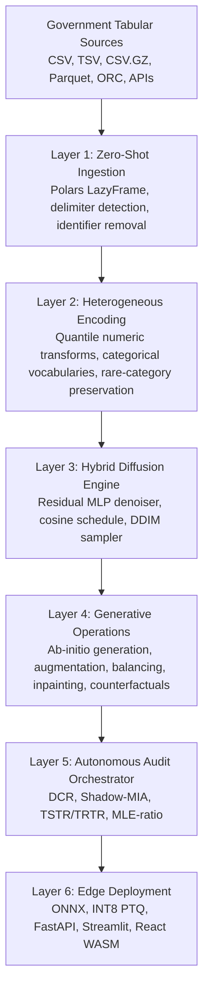
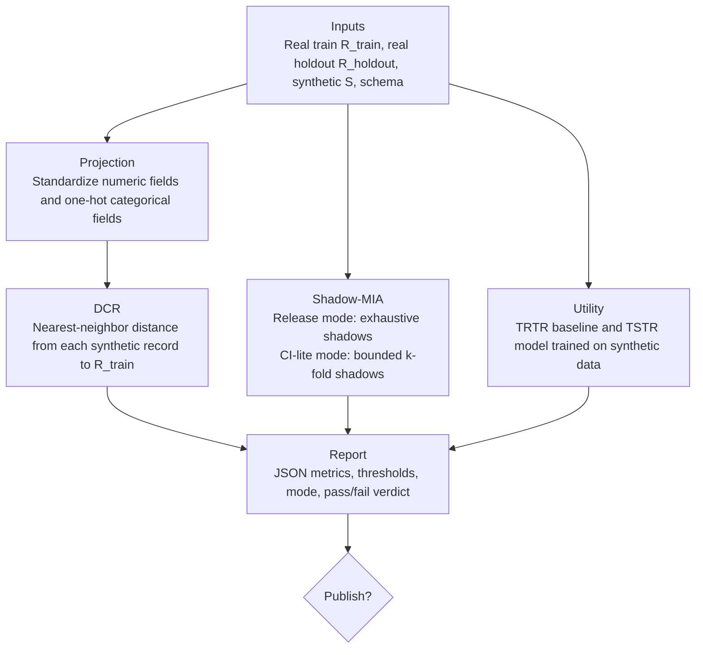

# DATALUS: Diffusion-Augmented Tabular Architecture for Local Utility and Security

> 🇧🇷 **Atenção Comissão Julgadora do 32º Prêmio Jovem Cientista:** A documentação oficial, elaborada com o rigor científico exigido pelo edital e detalhando o impacto na LGPD e em políticas públicas, encontra-se no arquivo [README_pt-BR.md](./README_pt-BR.md).

DATALUS is a production-oriented Generative AI framework for synthetic tabular data. It is designed for high-dimensional, heterogeneous, privacy-sensitive government datasets, with a specific proof-of-concept path for Brazilian public-sector health data. The system learns a joint distribution over tabular records, samples new microdata from that distribution, and subjects generated artifacts to reproducible privacy and utility audits before release.

DATALUS is not an anonymization script. It is a generative ecosystem for ab-initio synthesis, data augmentation, minority-class balancing, tabular inpainting, counterfactual modification, audit automation, ONNX export, INT8 edge inference, and browser-local execution through ONNX Runtime Web.

## Research And Public Data Context

Brazil's open-data policy is coordinated through the Infraestrutura Nacional de Dados Abertos (INDA), and [dados.gov.br](https://dados.gov.br) is the central catalog for public datasets. Government sources publish data across CSV, JSON, XML, ODS, RDF, APIs, Parquet-like analytic exports, and sector-specific repositories. The practical result is schema heterogeneity: inconsistent delimiters, lossy encodings, sparse columns, high-cardinality codes, rare municipalities, rare diseases, changing field names, and mixed numeric/string representations.

DATALUS implements ingestion and encoding policies for that reality:

- Lazy Polars scans avoid full in-memory Pandas loading.
- CSV scans detect common delimiters and use lossy UTF-8 decoding for legacy encodings.
- Identifier-like fields are removed before modeling.
- Sparse and free-text columns are rejected by explicit policy.
- Observed rare categories are preserved as first-class tokens; only unseen inference-time values map to `__UNKNOWN__`.
- Category frequency metadata is serialized so downstream audits can detect long-tail collapse.

Primary references:

- Brazilian open-data policy and dados.gov.br catalog: [Governo Digital Dados Abertos](https://www.gov.br/governodigital/pt-br/dados-abertos/dados-abertos), [Portal Brasileiro de Dados Abertos](https://www.gov.br/governodigital/pt-br/dados-abertos/portal-brasileiro-de-dados-abertos), [API Portal de Dados Abertos](https://www.gov.br/conecta/catalogo/apis/api-portal-de-dados-abertos).
- Tabular diffusion: [Kotelnikov et al., TabDDPM](https://arxiv.org/abs/2209.15421).
- RePaint inpainting: [Lugmayr et al.](https://arxiv.org/abs/2201.09865).
- Classifier-Free Guidance: [Ho and Salimans](https://arxiv.org/abs/2207.12598).
- DDIM sampling: [Song et al.](https://arxiv.org/abs/2010.02502).
- Membership inference attacks: [Shokri et al.](https://arxiv.org/abs/1610.05820).

## Architecture

The codebase uses a strict `src/` layout and Clean Architecture boundaries:

```text
src/datalus/
  domain/            Framework-free schemas and diffusion schedule math
  infrastructure/    Polars, PyTorch, ONNX, checkpointing, encoding adapters
  application/       Training, inference, audit, and export use cases
  interfaces/        Typer CLI and FastAPI delivery adapters
frontend/
  streamlit/         Python Streamlit shell
  component/         React TypeScript ONNX Runtime Web component
tests/               Unit and integration tests
```



## Generative Capabilities

DATALUS exposes distinct workflows because synthetic data systems have different operational goals:

| Capability                  | Purpose                                                                       | CLI                      |
| --------------------------- | ----------------------------------------------------------------------------- | ------------------------ |
| Ab-initio generation        | Create a new synthetic dataset from learned distributions.                    | `datalus sample`         |
| Data augmentation           | Append synthetic rows to a small dataset.                                     | `datalus augment`        |
| Minority balancing          | Generate records until target-class counts approach a requested distribution. | `datalus balance`        |
| Tabular inpainting          | Fill missing values while preserving observed fields at every reverse step.   | `datalus inpaint`        |
| Counterfactual modification | Apply column interventions and regenerate compatible records.                 | `datalus counterfactual` |
| Audit                       | Evaluate empirical privacy and predictive utility before release.             | `datalus audit`          |
| Edge export                 | Export EMA weights to ONNX and optional INT8.                                 | `datalus export-onnx`    |

The current denoiser supports Classifier-Free Guidance (CFG) at the diffusion layer through conditional and unconditional noise interpolation. CLI and API requests expose `cfg_scale` consistently; when models are trained without context vectors, `cfg_scale=1.0` is the equivalent unconditional path.

## Mathematical Foundation

### Forward Markov Chain

For a latent tabular vector $\mathbf{x}_0 \in \mathbb{R}^d$, the DDPM forward process corrupts the sample through a Markov chain:

$$
q(\mathbf{x}_t \mid \mathbf{x}_{t-1}) =
\mathcal{N}\left(\mathbf{x}_t;\sqrt{1-\beta_t}\mathbf{x}_{t-1},\beta_t\mathbf{I}\right).
$$

With $\alpha_t=1-\beta_t$ and $\bar{\alpha}_t=\prod_{s=1}^{t}\alpha_s$, the closed-form marginal is:

$$
q(\mathbf{x}_t \mid \mathbf{x}_0) =
\mathcal{N}\left(\mathbf{x}_t;\sqrt{\bar{\alpha}_t}\mathbf{x}_0,(1-\bar{\alpha}_t)\mathbf{I}\right),
$$

or equivalently:

$$
\mathbf{x}_t=\sqrt{\bar{\alpha}_t}\mathbf{x}_0+\sqrt{1-\bar{\alpha}_t}\boldsymbol{\epsilon},
\quad \boldsymbol{\epsilon}\sim\mathcal{N}(\mathbf{0},\mathbf{I}).
$$

### Reverse Process And Composite Loss

The denoiser $\boldsymbol{\epsilon}_{\theta}$ predicts the injected noise:

$$
p_{\theta}(\mathbf{x}_{t-1}\mid\mathbf{x}_t)
=
\mathcal{N}\left(\mathbf{x}_{t-1};\boldsymbol{\mu}_{\theta}(\mathbf{x}_t,t),\boldsymbol{\Sigma}_{\theta}(\mathbf{x}_t,t)\right).
$$

DATALUS uses a residual MLP with sinusoidal timestep embeddings and a cosine beta schedule. Numerical fields are quantile-normalized into a continuous domain; categorical fields are represented by learned embeddings and decoded by nearest learned embedding. The implemented objective is the simplified diffusion loss:

$$
\mathcal{L}_{\mathrm{MSE}}=
\mathbb{E}_{t,\mathbf{x}_0,\boldsymbol{\epsilon}}
\left[
\left\lVert
\boldsymbol{\epsilon} -
\boldsymbol{\epsilon}_{\theta}(\sqrt{\bar{\alpha}_t}\mathbf{x}_0+\sqrt{1-\bar{\alpha}_t}\boldsymbol{\epsilon},t)
\right\rVert_2^2
\right].
$$

For categorical-logit extensions, the intended TabDDPM composite objective is:

$$
\mathcal{L}_{\mathrm{total}}=
\lambda_{\mathrm{num}}\mathcal{L}_{\mathrm{MSE}}^{\mathrm{num}}
+
\lambda_{\mathrm{cat}}\mathcal{L}_{\mathrm{CE}}^{\mathrm{cat}}.
$$

### DDIM Sampling

DDIM reduces sampling from $T$ training steps to $S$ inference steps:

$$
\mathbf{x}_{t_{i-1}} =
\sqrt{\bar{\alpha}_{t_{i-1}}}
\left(
\frac{\mathbf{x}_{t_i}-\sqrt{1-\bar{\alpha}_{t_i}}\boldsymbol{\epsilon}_{\theta}(\mathbf{x}_{t_i},t_i)}
{\sqrt{\bar{\alpha}_{t_i}}}
\right)
+
\sqrt{1-\bar{\alpha}_{t_{i-1}}-\sigma_{t_i}^{2}}
\boldsymbol{\epsilon}_{\theta}(\mathbf{x}_{t_i},t_i)
+
\sigma_{t_i}\boldsymbol{\epsilon}.
$$

When $\eta=0$, $\sigma_{t_i}=0$, and sampling is deterministic for a fixed seed.

### Classifier-Free Guidance

During conditional inference, DATALUS combines unconditional and conditional noise predictions:

$$
\tilde{\boldsymbol{\epsilon}}_{\theta}(\mathbf{x}_t,\mathbf{c},t)
=
\boldsymbol{\epsilon}_{\theta}(\mathbf{x}_t,\varnothing,t)
+ w\left[
\boldsymbol{\epsilon}_{\theta}(\mathbf{x}_t,\mathbf{c},t)
-\boldsymbol{\epsilon}_{\theta}(\mathbf{x}_t,\varnothing,t)
\right].
$$

Because large $w$ amplifies noise prediction error, the ONNX export path records an INT8 CFG parity audit at $w=3.0$.

### RePaint Tabular Inpainting

For a known-value mask $\mathbf{m}$, observed coordinates are re-noised at each reverse step:

$$
\mathbf{x}_t^{\mathrm{known}} =
\sqrt{\bar{\alpha}_t}\mathbf{x}_0^{\mathrm{known}}
+
\sqrt{1-\bar{\alpha}_t}\boldsymbol{\epsilon}.
$$

The sampler merges known and unknown coordinates:

$$
\mathbf{x}_t =
\mathbf{m}\odot \mathbf{x}_t^{\mathrm{known}}
+ (1-\mathbf{m})\odot \mathbf{x}_t^{\mathrm{generated}}.
$$

Jump-back steps periodically reintroduce noise, improving consistency between observed and imputed fields.

## Autonomous Audit Orchestrator



### Distance To Closest Record

For each synthetic record $\hat{\mathbf{x}}_i$:

$$
\mathrm{DCR}(\hat{\mathbf{x}}_i)=
\min_{j\in\{1,\ldots,N\}} d(\hat{\mathbf{x}}_i,\mathbf{x}_j^{\mathrm{real}}).
$$

The OAA reports median DCR, low-percentile DCR, the alert threshold derived from real-record neighbor distances, and the proportion of synthetic records below that threshold.

### Shadow-Model Membership Inference

Following the Shokri threat model, the attacker learns features that distinguish records used to train a generator from non-member records. DATALUS computes an attack ROC-AUC:

$$
\mathrm{AUC}_{\mathrm{MIA}} =
\Pr\left(s_{\mathrm{member}} > s_{\mathrm{nonmember}}\right).
$$

`release` mode keeps the exhaustive protocol. `ci_lite` mode bounds rows, shadow count, neighbor count, and attack model size so GitHub Actions can execute privacy regression tests without substituting for official release audits.

### MLE-Ratio Utility

Utility is measured by Train on Synthetic, Test on Real (TSTR) against a Train on Real, Test on Real (TRTR) baseline:

$$
\mathrm{MLE}_{\mathrm{ratio}} =
\frac{\mathrm{AUC}_{\mathrm{TSTR}}}{\mathrm{AUC}_{\mathrm{TRTR}}}.
$$

The default utility approval threshold is $\mathrm{MLE}_{\mathrm{ratio}}\geq 0.90$.

## Deterministic Colab Training

DATALUS is designed for constrained training environments such as a Google Colab T4 session. The trainer saves diffusion weights, feature projector weights, optimizer and scheduler state, AMP GradScaler state, EMA weights, Python/NumPy/Torch/CUDA RNG states, configuration hash, and loss history. This makes interrupted sessions resumable without changing subsequent random draws.

## Installation

Python 3.11 or newer is required. For externally managed system Python installations, use a local virtual environment.

```bash
python -m venv .venv
.venv/bin/python -m pip install -e '.[dev]'
```

Frontend component:

```bash
cd frontend/component
npm ci
npm run test
npm run build
```

Python verification:

```bash
.venv/bin/python -m pytest -q
```

## CLI Workflow

```bash
datalus ingest raw.csv processed.parquet --schema-path artifacts/demo/schema_config.json --target-column target

datalus train artifacts/demo/schema_config.json processed.parquet artifacts/demo --epochs 5 --batch-size 2048

datalus sample artifacts/demo/checkpoints/checkpoint_latest.pt artifacts/demo/encoder_config.json synthetic.parquet --n-records 10000 --ddim-steps 50 --cfg-scale 1.0

datalus augment artifacts/demo/checkpoints/checkpoint_latest.pt artifacts/demo/encoder_config.json small.parquet augmented.parquet --n-records 5000

datalus balance artifacts/demo/checkpoints/checkpoint_latest.pt artifacts/demo/encoder_config.json train.parquet balanced.parquet target '{"0": 5000, "1": 5000}'

datalus inpaint artifacts/demo/checkpoints/checkpoint_latest.pt artifacts/demo/encoder_config.json incomplete.parquet inpainted.parquet

datalus counterfactual artifacts/demo/checkpoints/checkpoint_latest.pt artifacts/demo/encoder_config.json records.parquet counterfactual.parquet '{"municipality": "3550308"}'

datalus audit real_train.parquet synthetic.parquet artifacts/demo/schema_config.json artifacts/demo/audit_report.json --target-column target --mia-mode release

datalus audit real_train.parquet synthetic.parquet artifacts/demo/schema_config.json artifacts/demo/audit_ci.json --mia-mode ci_lite --max-audit-rows 512

datalus export-onnx artifacts/demo/checkpoints/checkpoint_latest.pt artifacts/demo/encoder_config.json artifacts/demo --quantize
```

## FastAPI

Artifact serving is enabled by default. Server-side PyTorch generation is disabled unless explicitly requested when constructing the app.

```bash
datalus serve artifacts --host 0.0.0.0 --port 8000
```

Core endpoints:

- `GET /health`
- `GET /artifacts`
- `GET /artifacts/{domain}/manifest`
- `GET /artifacts/{domain}/schema`
- `GET /artifacts/{domain}/model_int8.onnx`
- `GET /artifacts/{domain}/projector_config.json`
- `GET /audit/latest`
- `POST /generate`
- `POST /augment`
- `POST /balance`
- `POST /inpaint`
- `POST /counterfactual`

Example server-side generation request:

```json
{
  "domain": "datasus_sih",
  "n_records": 1000,
  "ddim_steps": 50,
  "seed": 42,
  "cfg_scale": 1.0
}
```

## ONNX, INT8, And Browser Inference

The export path writes `model_fp32.onnx`, optional `model_int8.onnx`, `encoder_config.json`, `projector_config.json`, and `manifest.json`. The React component downloads the ONNX artifact into browser cache, executes DDIM through `onnxruntime-web` WASM, and decodes latents with encoder and projector metadata. Numerical fields use inverse quantile interpolation. Categorical fields use exported projector embedding tables and the same nearest-embedding reconstruction policy used by Python inference.

INT8 export includes a high-guidance parity report:

```json
{
  "cfg_scale": 3.0,
  "amplified_max_abs_diff": 0.012,
  "categorical_agreement": null,
  "passed": true
}
```

This prevents a common edge failure mode: low raw quantization error that becomes operationally significant after CFG noise amplification.

## Development Verification

Current verification targets:

```bash
.venv/bin/python -m pytest -q
cd frontend/component
npm run test
npm run build
```

The tests cover diffusion schedules, RePaint shape/mask invariants, deterministic checkpoint RNG replay, Polars ingestion, long-tail category preservation, reversible encoding, CI-lite Shadow-MIA, API artifact serving, ONNX export, INT8 quantization, and CFG amplification parity.

## License

DATALUS is released under the Apache License 2.0.

## Citation

```bibtex
@misc{silva2026datalus,
  author = {Silva, Emanuel L{\'a}zaro Cust{\'o}dio},
  title = {DATALUS: Diffusion-Augmented Tabular Architecture for Local Utility and Security},
  year = {2026},
  howpublished = {\url{https://github.com/emanuellcs/datalus}},
  note = {Software, Apache License 2.0}
}
```
