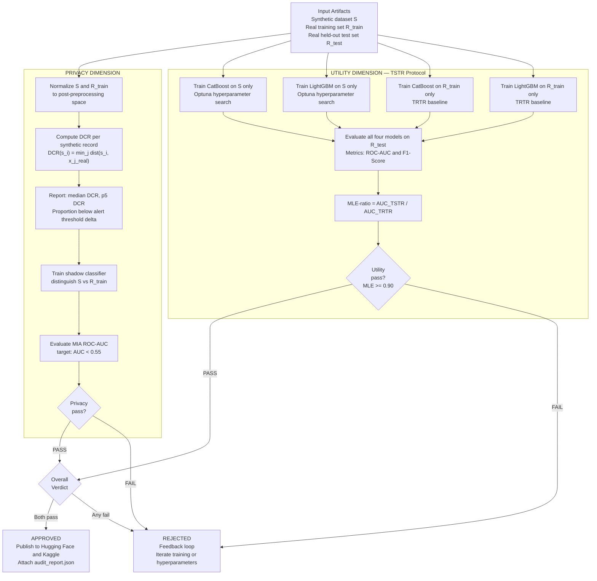

# DATALUS: Diffusion Augmented Tabular Architecture for Local Utility and Security

> 🇺🇸 **English** | 🇧🇷 [Documentação em Português Brasileiro (Banca CNPq)](./README_pt-BR.md)

[](https://www.python.org/downloads/)
[](https://pytorch.org/)
[](https://onnxruntime.ai/)
[](https://pola.rs/)
[](https://opensource.org/licenses/Apache-2.0)
[]()
[](https://huggingface.co/)

**DATALUS** is a production-grade, framework-agnostic Generative AI system for synthesizing high-fidelity, high-dimensional tabular data from sensitive government and clinical datasets. It resolves the structural tension between data privacy legislation (such as Brazil's LGPD) and the open-science imperative by learning the full joint probability distribution $p(\mathbf{X})$ of any input dataset via a **hybrid Denoising Diffusion Probabilistic Model (DDPM)** and generating statistically equivalent synthetic microdata carrying formal, quantifiable privacy guarantees.

The system was designed around four foundational objectives. First, to surpass the limitations of classical generative architectures: GAN-based models (CTGAN, TVAE) suffer from mode collapse, training instability, and difficulty modelling multimodal distributions; DATALUS replaces them with probabilistic diffusion (TabDDPM), which benchmarks demonstrate to be systematically superior on tabular data (Kotelnikov et al., 2023). Second, to deliver a genuinely agnostic framework: the system models heterogeneous tabular matrices without any manual schema intervention, inferring column topology automatically through a three-phase statistical protocol. Third, to enforce cryptographic-grade privacy: every generated artifact is subjected to automated Membership Inference Attack resistance testing and Distance-to-Closest-Record analysis before any release, providing a defensible legal basis under data protection law. Fourth, to enable safe institutional model training: downstream predictive models can be trained entirely on synthetic data, keeping real citizen records permanently isolated from the analytics environment.

The empirical proof-of-concept targets **DATASUS** (Brazil's national public health information system), covering approximately 15 million hospital admission records across 62 variables for the period 2018 to 2022. Trained artifacts are exported to **ONNX Runtime** with **INT8 Post-Training Quantization (PTQ)**, enabling silent offline inference on CPU-only commodity servers, which is the dominant hardware reality in Brazil's public sector.

## Table of Contents

1. [System Architecture: The Six-Layer Pipeline](#1-system-architecture-the-six-layer-pipeline)
2. [Mathematical Foundation of Hybrid Tabular Diffusion](#2-mathematical-foundation-of-hybrid-tabular-diffusion)
3. [Zero-Shot Preprocessing with Polars Lazy Evaluation](#3-zero-shot-preprocessing-with-polars-lazy-evaluation)
4. [Training Strategy and Optimization](#4-training-strategy-and-optimization)
5. [Advanced Inference Capabilities](#5-advanced-inference-capabilities)
6. [Autonomous Audit Orchestrator (OAA)](#6-autonomous-audit-orchestrator-oaa)
7. [Edge Deployment: ONNX Export, PTQ, and FastAPI](#7-edge-deployment-onnx-export-ptq-and-fastapi)
8. [Societal Impact and Open Science Ecosystem](#8-societal-impact-and-open-science-ecosystem)
9. [Monorepo Structure](#9-monorepo-structure)
10. [Installation and Getting Started](#10-installation-and-getting-started)
11. [API Reference and CLI Usage](#11-api-reference-and-cli-usage)
12. [Pre-trained Artifacts and Datasets](#12-pre-trained-artifacts-and-datasets)
13. [Citation and License](#13-citation-and-license)

## 1. System Architecture: The Six-Layer Pipeline

DATALUS is organized into six functional layers, each with strictly delimited responsibilities and explicit contract interfaces. Every layer is independently testable, configurable via YAML, and replaceable without affecting downstream layers. The following diagram renders natively on GitHub.

```mermaid
flowchart TD
    A["🗄️ RAW DATA SOURCES\nDATASUS · INEP · TCU · Any Government Tabular Source\nCSV · Parquet · ORC"]
    B["LAYER 1 — ZERO-SHOT AGNOSTIC INGESTION\nPolars scan_csv → LazyFrame DAG\nStatistical Topology Inference on 5% sample\nSink → Snappy-compressed Apache Parquet"]
    C["LAYER 2 — HETEROGENEOUS ENCODING\nContinuous: QuantileTransformer → uniform domain\nCategorical: learned embeddings, dim = ceil(log2 K)\nHigh-cardinality: hierarchical tokenization\nSchema serialized to schema_config.json"]
    D["LAYER 3 — HYBRID DIFFUSION ENGINE\nDual forward process: Gaussian + Embedding-Space\nDenoiser: Residual MLP + sinusoidal time embeddings\nLoss: lambda_num * L_MSE + lambda_cat * L_CE\nInference: DDIM accelerated sampling, S << T"]
    E["LAYER 4 — CONDITIONAL AND AUGMENTED INFERENCE\nClassifier-Free Guidance for targeted generation\nTabular Inpainting via RePaint adaptation\nCounterfactual Simulation via do-calculus\nStochastic Augmentation for minority oversampling"]
    F["LAYER 5 — AUTONOMOUS AUDIT ORCHESTRATOR\nPrivacy: DCR percentiles + MIA ROC-AUC\nUtility: TSTR, CatBoost + LightGBM, F1 + AUC\nMLE-ratio = AUC_TSTR / AUC_TRTR, threshold 0.90\nOutput: JSON report + binary PASS / FAIL verdict"]
    G["LAYER 6 — EXPORT AND DISTRIBUTION\nONNX export, opset 17, dynamic batch axis\nPTQ: FP32, FP16, INT8 dynamic quantization\nFastAPI async backend, Docker + Compose\nPublish to GitHub · Hugging Face · Kaggle"]

    A -->|Sensitive tabular input| B
    B -->|Type-resolved LazyFrame| C
    C -->|Unified continuous latent space| D
    D -->|Synthetic latent vectors| E
    E -->|Decoded synthetic records| F
    F -->|Audited artifact + JSON report| G
```



**Layer 1 (Zero-Shot Agnostic Ingestion)** accepts any government tabular dataset in CSV, Parquet, or ORC format, infers column topology automatically, and serializes the processed result to columnar Apache Parquet with Snappy compression. No user-defined schema is required, making the pipeline immediately operational on any government database without manual preparation.

**Layer 2 (Heterogeneous Encoding)** transforms the mixed data space into a unified continuous latent space $\mathbb{R}^d$ suitable for Gaussian diffusion. Numerical continuous features are mapped via `QuantileTransformer` (robust to extreme outliers). Categorical features receive learned embeddings of dimension $\lceil \log_2(K) \rceil$, where $K$ is cardinality. High-cardinality features, such as ICD-10 codes with hundreds of distinct values, receive hierarchical tokenization that groups categories into semantic subtrees before embedding construction.

**Layer 3 (Hybrid Diffusion Engine)** is the core generative component. It implements dual forward processes: Gaussian diffusion for continuous numerical features and Embedding-Space diffusion for categorical features, both parametrized by a deeply residual MLP denoiser with sinusoidal time embeddings. This architecture directly addresses the mode-collapse and training instability problems endemic to GAN-based tabular generators.

**Layer 4 (Conditional and Augmented Inference)** implements Classifier-Free Guidance (CFG) for targeted conditional generation, Tabular Inpainting for probabilistic deep imputation, Counterfactual Simulation for do-calculus policy interventions in latent space, and Stochastic Data Augmentation for minority class oversampling in imbalanced classification tasks.

**Layer 5 (OAA)** runs automatically after every artifact generation event and enforces both privacy and utility constraints before any dataset is published, generating a structured JSON audit report with a binary pass/fail verdict.

**Layer 6 (Export)** converts PyTorch weights to ONNX (opset 17), applies quantization at configurable precision levels (FP32, FP16, INT8), packages the asynchronous FastAPI backend, and publishes all artifacts to GitHub, Hugging Face, and Kaggle.

## 2. Mathematical Foundation of Hybrid Tabular Diffusion

### 2.1 The Forward Process (Gaussian Diffusion for Continuous Features)

The DDPM framework (Ho et al., 2020) defines a $T$-step Markovian stochastic process that progressively corrupts the original data $\mathbf{x}_0$ toward pure isotropic Gaussian noise $\mathbf{x}_T \sim \mathcal{N}(\mathbf{0}, \mathbf{I})$. The transition kernel at each step $t$ is:

$$q(\mathbf{x}_t \mid \mathbf{x}_{t-1}) = \mathcal{N}\!\left(\mathbf{x}_t;\; \sqrt{1 - \beta_t}\,\mathbf{x}_{t-1},\; \beta_t\,\mathbf{I}\right)$$

where $\beta_t \in (0, 1)$ is a variance schedule (linear, cosine, or learned). A critical property of this formulation is the closed-form marginal at any arbitrary timestep $t$, obtained by telescoping the Markov chain:

$$q(\mathbf{x}_t \mid \mathbf{x}_0) = \mathcal{N}\!\left(\mathbf{x}_t;\; \sqrt{\bar{\alpha}_t}\,\mathbf{x}_0,\; (1 - \bar{\alpha}_t)\,\mathbf{I}\right)$$

where $\alpha_t = 1 - \beta_t$ and $\bar{\alpha}_t = \prod_{s=1}^{t} \alpha_s$. This closed form makes training computationally tractable: samples from any forward-process step can be generated in $O(1)$ without iterating through all preceding steps.

### 2.2 Embedding-Space Diffusion for Categorical Features

Direct Gaussian diffusion over categorical variables is invalid because the space of categories lacks Euclidean structure. DATALUS adopts the Embedding-Space Diffusion approach (Austin et al., 2021): for each categorical variable with $K$ classes, a continuous embedding $\mathbf{e}_k \in \mathbb{R}^d$ is learned for each class $k \in \{1, \ldots, K\}$ via an embedding layer. The diffusion process operates over these continuous vectors. During the reverse process, a softmax classifier maps the recovered vector back to the categorical space. This allows the model to capture the semantic geometry of categories (learning, for example, that "hypertension" and "diabetes" are geometrically closer in latent space than "hypertension" and "bone fracture"), producing categorical correlations significantly more realistic than one-hot encoding alternatives.

### 2.3 The Reverse Process and Composite Training Objective

The model parameterizes the inverse distribution $p_\theta(\mathbf{x}_{t-1} \mid \mathbf{x}_t)$ via a neural network $\boldsymbol{\epsilon}_\theta$ and minimizes the simplified noise-prediction objective (Ho et al., 2020):

$$\mathcal{L}_{\text{simple}} = \mathbb{E}_{t,\, \mathbf{x}_0,\, \boldsymbol{\epsilon}}\!\left[\left\|\boldsymbol{\epsilon} - \boldsymbol{\epsilon}_\theta\!\left(\sqrt{\bar{\alpha}_t}\,\mathbf{x}_0 + \sqrt{1 - \bar{\alpha}_t}\,\boldsymbol{\epsilon},\; t\right)\right\|^2\right]$$

For mixed tabular data, DATALUS employs a composite loss that handles both data types simultaneously within a single training pass:

$$\mathcal{L}_{\text{total}} = \lambda_{\text{num}}\,\mathcal{L}_{\text{MSE}}^{\text{num}} + \lambda_{\text{cat}}\,\mathcal{L}_{\text{CE}}^{\text{cat}}$$

where $\mathcal{L}_{\text{MSE}}^{\text{num}}$ is the mean-squared error over continuous components, $\mathcal{L}_{\text{CE}}^{\text{cat}}$ is the cross-entropy over categorical logits (after embedding decoding), and $\lambda_{\text{num}}$, $\lambda_{\text{cat}}$ are weighting coefficients learned jointly during training via homoscedastic uncertainty (Kendall and Gal, 2018), eliminating the need for manual loss-balance tuning across heterogeneous column types.

### 2.4 The Denoiser: Residual MLP with Sinusoidal Time Embedding

The noise predictor $\boldsymbol{\epsilon}_\theta$ is a deeply residual Multi-Layer Perceptron. The choice of MLP over attention-based architectures is deliberate: for tabular data with moderate input dimensionality (tens to a few thousand columns), the MLP achieves a superior cost-to-quality ratio during inference, particularly on the CPU hardware that is the target deployment environment for government servers.

The timestep $t$ is encoded via a sinusoidal Fourier transformation, producing a time embedding vector $\mathbf{e}_t \in \mathbb{R}^d$. Each residual block follows the structure:

$$\mathbf{h}_{l+1} = \mathbf{h}_l + \text{SiLU}\!\left(\text{LayerNorm}\!\left(\text{Linear}(\mathbf{h}_l) + \mathbf{W}_t\,\mathbf{e}_t\right)\right)$$

where SiLU (Sigmoid Linear Unit) is the activation function and $\mathbf{W}_t$ is the learned time-embedding projection matrix. Injecting $\mathbf{e}_t$ at every hidden layer allows the model to condition both the magnitude and direction of each denoising step on the current noise level, which is the primary mechanism behind generation quality across all timesteps.

### 2.5 Accelerated Sampling with DDIM

Standard DDPM sampling requires $T = 1000$ sequential denoising steps, which is prohibitively slow for production use. DATALUS implements the **DDIM** (Song et al., 2020) deterministic sampling scheme, reducing required steps to $S \in \{50, 100\}$ without meaningful quality degradation:

$$\mathbf{x}_{t_{i-1}} = \sqrt{\bar{\alpha}_{t_{i-1}}}\underbrace{\left(\frac{\mathbf{x}_{t_i} - \sqrt{1 - \bar{\alpha}_{t_i}}\,\boldsymbol{\epsilon}_\theta(\mathbf{x}_{t_i},\, t_i)}{\sqrt{\bar{\alpha}_{t_i}}}\right)}_{\text{"predicted } \mathbf{x}_0\text{"}} + \sqrt{1 - \bar{\alpha}_{t_{i-1}} - \sigma_{t_i}^2}\;\boldsymbol{\epsilon}_\theta(\mathbf{x}_{t_i},\, t_i) + \sigma_{t_i}\,\boldsymbol{\epsilon}$$

When $\sigma_{t_i} = 0$ for all steps, the process is fully deterministic given the initial noise $\mathbf{x}_T$. This property is critical for scientific auditability: a fixed random seed guarantees exact reproducibility of any generated synthetic dataset, enabling independent verification by external auditors or competing research groups.

### 2.6 Conditional Generation via Classifier-Free Guidance

CFG (Ho and Salimans, 2022) enables attribute-conditional generation without a separate external classifier. During training, the conditioning vector is replaced by a null vector $\varnothing$ with probability $p_{\text{uncond}} = 0.1$. During inference, the effective score estimate is:

$$\tilde{\boldsymbol{\epsilon}}_\theta(\mathbf{x}_t, \mathbf{c}, t) = \boldsymbol{\epsilon}_\theta(\mathbf{x}_t, \varnothing, t) + w \cdot \left[\boldsymbol{\epsilon}_\theta(\mathbf{x}_t, \mathbf{c}, t) - \boldsymbol{\epsilon}_\theta(\mathbf{x}_t, \varnothing, t)\right]$$

where $\mathbf{c}$ is the user-specified conditioning vector and $w > 1$ is the guidance scale (typical values: 1.5 to 5.0 for tabular data). A public health analyst can, for example, request 10,000 synthetic records of female patients aged 40 to 60 with a primary diagnosis of diabetes mellitus (ICD E11) from Brazil's Northeast region, and the system will produce records respecting all learned conditional distributions for the specified attributes.

## 3. Zero-Shot Preprocessing with Polars Lazy Evaluation

### 3.1 The Out-of-Memory Problem at Government Scale

DATASUS datasets can contain tens of millions of records across hundreds of columns, yielding CSV files routinely exceeding 50 GB. The free-tier Google Colab environment provides approximately 12.7 GB of shared RAM, making full in-memory Pandas loading infeasible: Pandas materializes the entire dataset at once, typically consuming 5 to 10 times the on-disk file size due to Python object overhead. DATALUS was designed from the outset to operate within this constraint, not around it.

### 3.2 Polars LazyFrame and the DAG Execution Model

DATALUS replaces Pandas with **Polars**, which implements lazy evaluation via a query execution engine based on a directed acyclic computation graph (DAG). In lazy mode, filters, projections, joins, and aggregations are represented as DAG nodes, optimized via predicate pushdown and projection pruning, and materialized only when explicitly requested. The serialization format is **Apache Parquet with Snappy compression**, enabling selective column reads without deserializing the full file, schema-aware storage, and high-throughput decompression.

```python
import polars as pl

# Lazy scan: no data is read at this point
lazy_frame = pl.scan_csv(
    "datasus_sih_2018_2022.csv",
    infer_schema_length=10_000,
    null_values=["", "NA", "N/A", "null", "NULL"],
    try_parse_dates=True,
)

# Transformation graph: zero memory cost at this stage
processed = (
    lazy_frame
    .filter(pl.col("ANO_CMPT").is_between(2018, 2023))
    .with_columns([
        pl.col("NASC").cast(pl.Date),
        pl.col("VAL_TOT").cast(pl.Float32).clip_min(0.0),
    ])
    .drop_nulls(subset=["DIAG_PRINC", "SEXO", "NASC"])
)

# Execution is materialized only here, streaming directly to Parquet in chunks
processed.sink_parquet(
    "datasus_sih_processed.parquet",
    compression="snappy",
    row_group_size=100_000,
)
```

### 3.3 Zero-Shot Topology Inference Protocol

Instead of requiring manual schema declaration, the system executes a three-phase automatic topology inference protocol. In Phase 1 (Statistical Inspection), the system draws a stratified 5% sample and computes cardinality, null proportion, frequency distribution, skewness, and kurtosis for each column. In Phase 2 (Heuristic Classification), each column is assigned to one of nine categories: continuous numerical, discrete numerical, ordinal categorical, low-cardinality nominal (up to 50 categories), high-cardinality nominal (more than 50), free text, identifier (automatically discarded by privacy policy before any model training), date/time, or boolean. In Phase 3 (Encoding Strategy Selection), each category receives a deterministic preprocessing strategy and the full mapping is serialized into `schema_config.json`, which travels alongside every trained model to guarantee exact pipeline reproduction during inference on any deployment target.

## 4. Training Strategy and Optimization

### 4.1 Automatic Mixed Precision and Deterministic Checkpointing

Primary training runs on NVIDIA GPU instances using PyTorch's `torch.cuda.amp` in FP16 mode, providing a 2x to 3x throughput increase on Tensor Cores and halving VRAM consumption. The `GradScaler` module prevents FP16 gradient underflow for values near $10^{-8}$.

To handle session timeouts in cloud training environments (such as Google Colab's 12-hour limit), DATALUS implements a deterministic checkpointing protocol that snapshots the complete training state every 500 steps, including all random seeds across PyTorch, NumPy, and Python:

```python
def save_checkpoint(model, optimizer, scaler, step, epoch, loss_history, path):
    """Saves a complete, deterministic training state snapshot."""
    checkpoint = {
        "step": step,
        "epoch": epoch,
        "model_state_dict": model.state_dict(),
        "optimizer_state_dict": optimizer.state_dict(),
        "scaler_state_dict": scaler.state_dict(),
        "torch_rng_state": torch.get_rng_state(),
        "numpy_rng_state": np.random.get_state(),
        "python_rng_state": random.getstate(),
        "cuda_rng_state": torch.cuda.get_rng_state() if torch.cuda.is_available() else None,
        "loss_history": loss_history,
    }
    torch.save(checkpoint, path)
```

On session resumption, all states are restored integrally before training continues. The determinism of the seeds guarantees the batch sampling order is identical to what would have been generated without interruption, eliminating selection bias from restart events.

### 4.2 Optimizer, Schedule, and EMA Regularization

DATALUS uses **AdamW** (Loshchilov and Hutter, 2019) with $\beta_1 = 0.9$, $\beta_2 = 0.999$, $\epsilon = 10^{-8}$, and weight decay $10^{-4}$ applied to all parameters except biases and normalization parameters. The learning rate schedule applies a 500-step linear warm-up followed by cosine annealing to $\eta_{\min} = 10^{-6}$. An **Exponential Moving Average (EMA)** of model weights (decay factor 0.9999) is maintained and used exclusively during sampling, consistently producing higher-quality synthetic records than the instantaneous weights, particularly in the later training stages where the loss oscillates near the minimum.

## 5. Advanced Inference Capabilities

### 5.1 Stochastic Data Augmentation for Imbalanced Datasets

The base generation capability supports two production use cases that address common data scarcity problems in government analytics. Dataset expansion augments small datasets with statistically consistent synthetic samples to improve downstream model generalization. Minority class balancing generates targeted synthetic samples when the imbalance ratio exceeds 10:1, as is common in rare-disease detection or fraud identification tasks in public procurement data. The system estimates the minority class density by conditioning via CFG and generates additional records until the user-configured class ratio is achieved, without repeating or interpolating real records.

### 5.2 Tabular Inpainting via RePaint

Tabular Inpainting solves deep probabilistic imputation: given a record with observed columns $\mathbf{x}_{\text{obs}}$ and missing columns $\mathbf{x}_{\text{miss}}$ (represented as NaN), the system samples values consistent with the conditional distribution $p(\mathbf{x}_{\text{miss}} \mid \mathbf{x}_{\text{obs}})$ via a tabular adaptation of the RePaint algorithm (Lugmayr et al., 2022). During reverse denoising, coordinates corresponding to observed columns are replaced at every step $t$ by the correctly noised value:

$$\mathbf{x}_t^{\text{obs}} = \sqrt{\bar{\alpha}_t}\,\mathbf{x}_0^{\text{obs}} + \sqrt{1 - \bar{\alpha}_t}\,\boldsymbol{\epsilon}$$

A jump-back schedule periodically reintroduces noise and redoes denoising to enforce consistency between observed and generated components. This mechanism is particularly valuable for recovering corrupted government databases where fields such as postal codes, birth dates, or procedure codes were lost during system migrations or hardware failures.

### 5.3 Counterfactual Simulation for Policy Analysis

Counterfactual Simulation is a direct decision-support tool for public policy analysis. Given an observed record $\mathbf{x}_0$ and a Pearl-style intervention $\text{do}(X_j = v)$ on variable $j$, the system produces the counterfactual record $\mathbf{x}_0^{\text{cf}}$ that simultaneously satisfies the specified intervention and maximizes proximity to the original in all other variables under the learned latent-space distance metric. The implementation partially corrupts $\mathbf{x}_0$ to step $t^* < T$ (where $t^*$ controls the degree of permitted modification), applies the intervention in latent space, and resumes denoising with the intervention condition active. The Ministry of Health can, for instance, simulate the effect of expanding the Family Health Program on hospital admission rates by intervening on the "primary care coverage per municipality" variable and observing distributional shifts in the generated admission records.

## 6. Autonomous Audit Orchestrator (OAA)

Synthetic data is only trustworthy if its privacy and utility can be demonstrated through repeatable, externally verifiable mathematical protocols. The OAA enforces this requirement automatically after every artifact generation event, producing a structured JSON report with all computed metrics, experiment metadata, and a binary pass/fail verdict. No artifact is published to any public registry before the OAA issues an approval.



### 6.1 Privacy Dimension: Distance to Closest Record (DCR)

The primary privacy metric is the **DCR**, which measures, for each synthetic record $\hat{\mathbf{x}}_i$, the Euclidean distance to the closest real training record in the normalized post-preprocessing space:

$$\text{DCR}(\hat{\mathbf{x}}_i) = \min_{j \in \{1,\ldots,N\}} d(\hat{\mathbf{x}}_i,\; \mathbf{x}_j^{\text{real}})$$

A distribution of DCRs concentrated near zero is the signature of model memorization, constituting a privacy breach under Brazil's LGPD Article 12. The OAA reports the **median DCR**, the **5th-percentile DCR**, and the **proportion of synthetic records below alert threshold** $\delta_{\text{alert}}$ (default: 5% of the data-space amplitude). Privacy approval requires simultaneously: the proportion below $\delta_{\text{alert}}$ less than 1% and the Membership Inference Attack ROC-AUC below 0.55 (indistinguishable from random guessing).

### 6.2 Utility Dimension: MLE-Ratio via TSTR

The utility evaluation follows the **Train on Synthetic, Test on Real (TSTR)** methodology (the de-facto standard in the synthetic data literature). Two gradient boosting models (CatBoost and LightGBM, with Optuna hyperparameter search) are trained exclusively on synthetic data and evaluated on the real held-out test set. The same experiment is repeated with real training data (TRTR baseline). Both ROC-AUC and F1-Score are reported to characterize performance on the imbalanced classification tasks common in clinical datasets. The MLE ratio is:

$$\text{MLE}_{\text{ratio}} = \frac{\text{AUC}_{\text{TSTR}}}{\text{AUC}_{\text{TRTR}}}$$

An $\text{MLE}_{\text{ratio}} \geq 0.90$ constitutes the DATALUS utility pass threshold: the synthetic data preserves more than 90% of the predictive utility of the real data. Values below this trigger a feedback loop requiring additional training iterations or hyperparameter adjustment before any artifact is published.

## 7. Edge Deployment: ONNX Export, PTQ, and FastAPI

### 7.1 Why Hardware Independence Matters for Government Adoption

Municipal and state servers in Brazil predominantly operate on commodity CPUs (Intel/AMD hardware from the 2015 to 2020 generation) with 8 to 32 GB of RAM and no dedicated GPUs. Any solution requiring data-center GPUs for synthetic data generation will have zero adoption in the municipal health secretariats that most urgently need this capability. The ONNX + PTQ pipeline solves this by fully decoupling training (GPU-accelerated, cloud-based) from inference (CPU-optimized, permanently offline). Hardware independence is not a convenience feature; it is a prerequisite for meaningful public-sector adoption.

### 7.2 ONNX Export and Graph Optimization

The MLP denoiser is exported via static graph tracing (`torch.onnx.export`, opset 17). The batch dimension is marked as a dynamic axis, allowing the same artifact to serve both single-record and batch generation. Post-export, the graph is optimized via `onnxruntime.transformers.optimizer` (layer fusion, common subexpression elimination, identity operation removal), reducing inference latency by up to 40% in internal benchmarks.

### 7.3 Post-Training Quantization

| Format | Memory Reduction | Inference Speedup | Recommended Use Case                                                  |
| ------ | ---------------- | ----------------- | --------------------------------------------------------------------- |
| FP32   | Baseline         | Baseline          | Auditors requiring exact numerical reproducibility                    |
| FP16   | 50%              | Similar to FP32   | Servers with native FP16 CPU support                                  |
| INT8   | 75%              | 2x to 4x          | Municipal servers with AVX2 instructions (Intel Haswell+, AMD Zen 2+) |

```python
import onnxruntime as ort
from onnxruntime.quantization import quantize_dynamic, QuantType

# Export from PyTorch using EMA weights
torch.onnx.export(
    ema_model,
    dummy_input,
    "model_fp32.onnx",
    opset_version=17,
    dynamic_axes={"x_t": {0: "batch_size"}},
)

# Dynamic INT8 quantization (no calibration dataset required)
quantize_dynamic(
    "model_fp32.onnx",
    "model_int8.onnx",
    weight_type=QuantType.QInt8,
)
```

INT8 dynamic quantization quantizes weights statically at conversion time and activations dynamically at runtime, without requiring a separate calibration dataset. This simplifies model updates when new training data become available. The DATASUS proof-of-concept performance target is: generation of 100,000 synthetic records with the INT8 artifact on a 10th-generation Intel Core i7 CPU, no GPU, in under 60 seconds.

### 7.4 FastAPI Async Backend

The inference backend is implemented in **FastAPI** with an asynchronous ONNX Runtime session. The `/generate` endpoint accepts a JSON payload with generation parameters (number of records, CFG conditioning vectors, random seed) and returns the synthetic dataset as JSON or binary Parquet depending on the `Accept` header. The backend is containerized with Docker and orchestrated via Docker Compose, enabling deployment on any server with Docker installed regardless of the underlying operating system. The production image (`python:3.11-slim`) with minimal dependencies yields approximately 800 MB, requiring no PyTorch or training libraries in the production environment. The frontend layer is a dynamic interface that adapts its input controls and output visualizations to the metadata of the instantiated model, reading column names, data types, cardinality ranges, and conditioning attributes from `schema_config.json` at runtime.

## 8. Societal Impact and Open Science Ecosystem

The societal impact of DATALUS operates across four dimensions that together constitute the "AI for the Common Good" value proposition.

The first dimension is **democratization of data science access**. The current regime of restricted government microdata concentrates research capacity in institutions with formal data-sharing agreements and dedicated legal staff. By publishing high-quality synthetic datasets on Hugging Face and Kaggle under open licenses, DATALUS allows university laboratories, independent researchers, and early-stage health-tech startups to prototype predictive models with realistic Brazilian health data without the prohibitive costs of clinical data licensing or the procedural delays of Ethics Committee approvals (CEPs).

The second dimension is **hardware independence for the public sector**. The INT8 ONNX quantization allows the full generative inference pipeline to run on standard office-grade CPUs at 2x to 4x the speed of unquantized inference, with a 75% reduction in memory footprint. A municipal health secretariat can generate a complete operational synthetic dataset in under 60 seconds on hardware it already owns, with no cloud dependency and no GPU budget.

The third dimension is **evidence-based public policy through safe simulation**. The Counterfactual Simulation capability enables policy analysts to model the consequences of hypothetical interventions on the learned distributional model, without ever exposing real citizen records to the analysis environment. This transforms the generative model from a data-anonymization tool into a policy decision-support instrument.

The fourth dimension is **legal decompression under data protection law**. Once a synthetic dataset passes the OAA's dual audit protocol, it can be published immediately on open-data portals without triggering the data-sharing restrictions of privacy legislation. The audit report JSON constitutes auditable technical evidence that the published data falls within the scope of anonymized data under LGPD Article 12, eliminating the legal friction that currently suppresses the availability of high-value government microdata.

The monorepo on GitHub is fully open under Apache 2.0. Hugging Face hosts the model registry and all ONNX artifacts with versioned Model Cards (Mitchell et al., 2019). Kaggle hosts the synthetic datasets alongside a progressive series of didactic notebooks covering the diffusion mathematics, the data engineering pipeline, audit metric interpretation, and practical framework usage, serving both as scientific replication materials and educational resources for the Brazilian AI community.

## 9. Monorepo Structure

```
datalus/
├── core/
│   ├── diffusion/               # DDPM / DDIM implementation
│   ├── preprocessing/           # Zero-Shot Preprocessing pipeline (Polars)
│   ├── models/                  # Residual MLP denoiser architecture
│   └── audit/                   # OAA module (DCR, MIA, TSTR, F1)
├── training/
│   ├── configs/                 # YAML configuration files per dataset
│   ├── scripts/                 # Training and evaluation scripts
│   └── notebooks/               # Colab-ready progressive didactic notebooks
├── inference/
│   ├── api/                     # FastAPI application (main.py, routers, schemas)
│   ├── onnx/                    # Export and quantization scripts
│   └── docker/                  # Dockerfile and docker-compose.yml
├── frontend/
│   ├── streamlit/               # Streamlit interface for data scientists
│   └── react/                   # React / TypeScript interface for government portals
├── docs/                        # Technical documentation (MkDocs)
└── tests/                       # Unit and integration test suite (80%+ line coverage)
```

## 10. Installation and Getting Started

### 10.1 Requirements

Python 3.11 or higher is required. A CUDA-capable GPU is strongly recommended for training. Inference requires only a CPU with AVX2 support for optimal INT8 performance.

### 10.2 Clone and Install

```bash
git clone https://github.com/emanuellcs/datalus.git
cd datalus
pip install -r requirements.txt
```

### 10.3 Running the Full Pipeline

```bash
# Step 1: Zero-Shot Preprocessing (Lazy Ingestion via Polars)
python core/preprocessing/preprocessor.py \
  --input data/raw/datasus_sih_2018_2022.csv \
  --output data/processed/datasus_sih.parquet

# Step 2: Training with Automatic Mixed Precision
python training/scripts/train.py \
  --config training/configs/datasus_sih.yaml \
  --checkpoint-dir checkpoints/datasus_sih/

# Step 3: Export to ONNX and apply PTQ
python inference/onnx/export.py \
  --checkpoint checkpoints/datasus_sih/best_ema.pt \
  --output-dir artifacts/datasus_sih_v1.0/ \
  --quantize-int8

# Step 4: Run the Autonomous Audit Orchestrator
python core/audit/oaa.py \
  --real data/processed/datasus_sih_test.parquet \
  --synth artifacts/datasus_sih_v1.0/synthetic_output.parquet \
  --report-out artifacts/datasus_sih_v1.0/audit_report.json

# Step 5: Launch the Edge Inference API
uvicorn inference.api.main:app --host 0.0.0.0 --port 8000
```

## 11. API Reference and CLI Usage

### 11.1 REST API: Generate Synthetic Records

**Endpoint:** `POST /generate`

```json
{
  "n_records": 10000,
  "ddim_steps": 100,
  "random_seed": 42,
  "guidance_scale": 2.0,
  "conditioning": {
    "SEXO": 1,
    "IDADE_FAIXA": "40-60",
    "DIAG_PRINC_PREFIX": "E11"
  }
}
```

Set `Accept: application/octet-stream` to receive the result as binary Parquet for high-throughput batch applications.

### 11.2 REST API: OAA Audit Report

**Endpoint:** `GET /audit/latest` returns the most recent JSON audit report, including all DCR percentiles, MIA ROC-AUC, TSTR ROC-AUC and F1-Score for both CatBoost and LightGBM, the MLE ratio, and the binary overall verdict.

### 11.3 Python SDK

```python
from core.diffusion.sampler import DDIMSampler
from core.preprocessing.preprocessor import ZeroShotPreprocessor
import onnxruntime as ort

preprocessor = ZeroShotPreprocessor.from_config(
    "artifacts/datasus_sih_v1.0/schema_config.json"
)
session = ort.InferenceSession(
    "artifacts/datasus_sih_v1.0/model_int8.onnx",
    providers=["CPUExecutionProvider"],
)
sampler = DDIMSampler(session=session, ddim_steps=100, seed=42)
synthetic_latent = sampler.sample(n_records=5_000)
synthetic_df = preprocessor.inverse_transform(synthetic_latent)
synthetic_df.write_parquet("outputs/synthetic_records.parquet")
```

## 12. Pre-trained Artifacts and Datasets

```
datalus-datasus-sih-v1.0/
├── model_card.md                # Detailed Model Card (Mitchell et al., 2019)
├── config.json                  # Hyperparameters and model configuration
├── schema_config.json           # Column mapping and transformation schema
├── model_fp32.onnx              # FP32 artifact (maximum precision)
├── model_fp16.onnx              # FP16 artifact (half precision)
├── model_int8.onnx              # INT8 artifact (CPU-optimized for edge deployment)
├── audit_report.json            # Full OAA audit report
└── sample_outputs/              # Sample synthetic records for visual inspection
```

## 13. Citation and License

DATALUS is released under the **Apache License 2.0**, permitting unrestricted commercial and governmental use, modification, and redistribution with preservation of copyright notices.

```bibtex
@software{datalus,
  author    = {Emanuel Lázaro},
  title     = {DATALUS: Diffusion Augmented Tabular Architecture for Local Utility and Security},
  year      = {2026},
  publisher = {GitHub},
  url       = {https://github.com/emanuellcs/datalus}
}
```

**Core references:** Ho et al. (2020), NeurIPS 33. Song et al. (2020), ICLR 2021. Ho and Salimans (2022), NeurIPS 2021 Workshop. Austin et al. (2021), NeurIPS 34. Kotelnikov et al. (2023), ICML 2023. Loshchilov and Hutter (2019), ICLR 2019. Lugmayr et al. (2022), CVPR 2022. Mitchell et al. (2019), ACM FAccT. Prokhorenkova et al. (2018), NeurIPS 31. Ke et al. (2017), NeurIPS 30.
