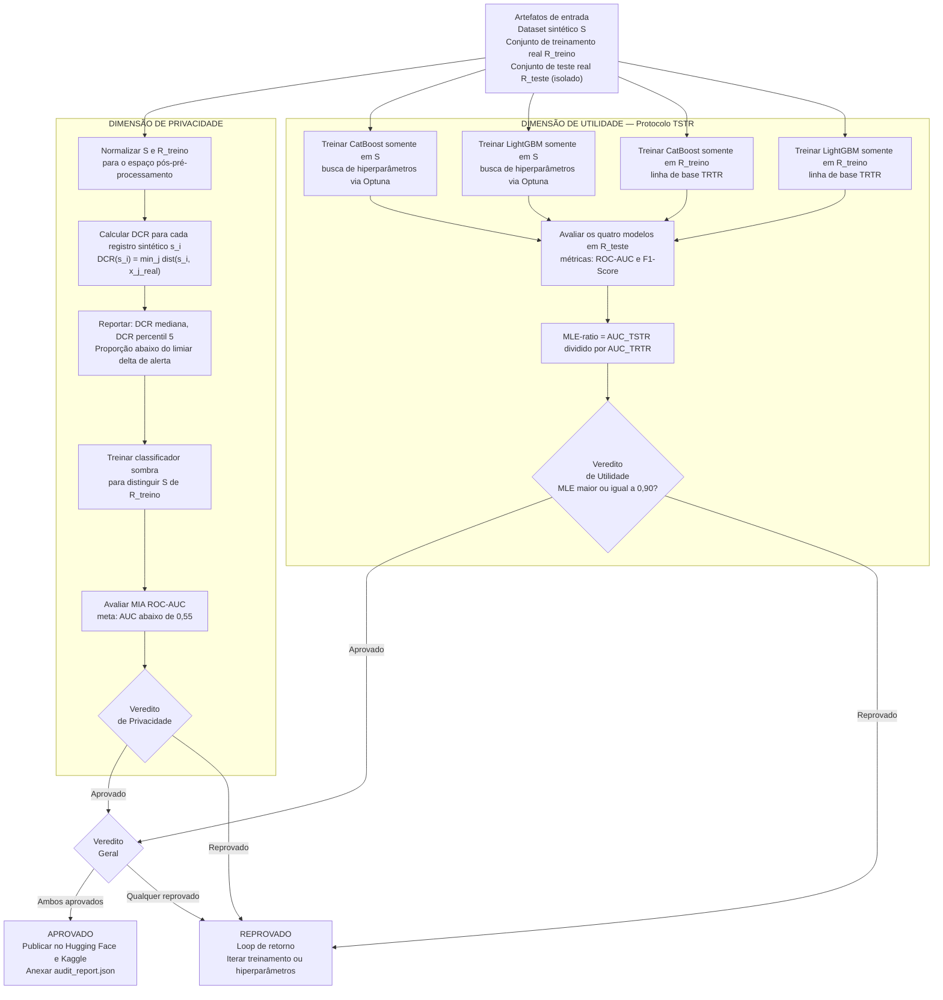

# DATALUS: Arquitetura de Difusão Tabular para Utilidade e Segurança Local

> 🇧🇷 **Português Brasileiro** | 🇺🇸 [International Documentation in English](./README.md)

[](https://www.python.org/downloads/)
[](https://pytorch.org/)
[](https://onnxruntime.ai/)
[](https://opensource.org/licenses/Apache-2.0)
[](https://huggingface.co/)

- **Autor:** Emanuel Lázaro Custódio Silva
- **Submissão Oficial:** 32º Prêmio Jovem Cientista (2026)
- **Tema Central:** Inteligência Artificial para o Bem Comum
- **Linha de Pesquisa:** Inteligência Artificial e Tecnologia
- **Categoria:** Estudante do Ensino Superior
- **Instituição:** Centro Universitário Internacional (UNINTER), Ciência da Computação
- **Orientador:** *A ser definido*

## Nota Introdutória

Este documento apresenta o projeto **DATALUS** (Diffusion Augmented Tabular Architecture for Local Utility and Security) à Comissão Julgadora do 32º Prêmio Jovem Cientista. O objetivo é expor, com fidelidade ao método científico, a motivação técnica do trabalho, as decisões de arquitetura e os protocolos de avaliação adotados, bem como o potencial de contribuição para a administração pública e para a pesquisa brasileira.

O projeto é fruto do esforço de um estudante de Ciência da Computação, que identificou na literatura de Inteligência Artificial Generativa uma oportunidade concreta de aplicação ao contexto do setor público brasileiro. A documentação internacional completa, em inglês e voltada à comunidade de engenharia de MLOps, encontra-se no arquivo [`README.md`](./README.md) do mesmo repositório.

## Sumário

1. [O Problema Técnico e Institucional Abordado](#1-o-problema-técnico-e-institucional-abordado)
2. [Objetivos do Sistema](#2-objetivos-do-sistema)
3. [Arquitetura do Framework: Seis Camadas Funcionais](#3-arquitetura-do-framework-seis-camadas-funcionais)
4. [Fundamentos Matemáticos do Motor de Difusão Híbrido](#4-fundamentos-matemáticos-do-motor-de-difusão-híbrido)
5. [Pipeline de Ingestão Zero-Shot com Avaliação Preguiçosa](#5-pipeline-de-ingestão-zero-shot-com-avaliação-preguiçosa)
6. [Prova de Conceito com o DATASUS](#6-prova-de-conceito-com-o-datasus)
7. [Orquestrador Autônomo de Auditoria: Protocolos de Privacidade e Utilidade](#7-orquestrador-autônomo-de-auditoria-protocolos-de-privacidade-e-utilidade)
8. [Conformidade com a LGPD](#8-conformidade-com-a-lgpd)
9. [Inferência em Borda para Infraestrutura Governamental](#9-inferência-em-borda-para-infraestrutura-governamental)
10. [Recursos Técnicos e Capacidades de Inferência](#10-recursos-técnicos-e-capacidades-de-inferência)
11. [Ecossistema de Ciência Aberta](#11-ecossistema-de-ciência-aberta)
12. [Impacto Social e Alinhamento com Políticas Públicas](#12-impacto-social-e-alinhamento-com-políticas-públicas)
13. [Roadmap e Trabalhos Futuros](#13-roadmap-e-trabalhos-futuros)
14. [Referências Científicas Fundamentais](#14-referências-científicas-fundamentais)

## 1. O Problema Técnico e Institucional Abordado

### 1.1 O Conflito entre a LGPD e a Ciência Aberta

A Lei Geral de Proteção de Dados (Lei nº 13.709/2018) estabelece, em seus artigos 7º, 11º e 23º, restrições ao tratamento de dados pessoais, com disposições específicas para dados sensíveis relacionados à saúde. Ao mesmo tempo, a política de dados abertos prevista na Lei de Acesso à Informação (Lei nº 12.527/2011) e a agenda de ciência aberta do CNPq e da CAPES pressupõem a publicação de microdados para que pesquisadores independentes possam replicar estudos e desenvolver políticas baseadas em evidências.

A resultante desse conflito normativo é a supressão de bases de dados de considerável valor científico. O DATASUS, por exemplo, mantém registros granulares de internações hospitalares, procedimentos ambulatoriais e óbitos que, se mais amplamente disponíveis, poderiam acelerar o desenvolvimento de modelos preditivos para vigilância epidemiológica e alocação de recursos hospitalares. Contudo, a granularidade que torna esses dados valiosos é precisamente a que os torna juridicamente sensíveis.

### 1.2 A Limitação das Abordagens Convencionais de Anonimização

A anonimização estática por supressão ou generalização (k-anonimato, l-diversidade) é considerada insuficiente por parte relevante da literatura de segurança de dados. O trabalho de Narayanan e Shmatikoff (2008) demonstrou que dados pseudonimizados e agregados são vulneráveis a ataques de reidentificação quando combinados com fontes externas, tornando abordagens determinísticas inadequadas para o nível de proteção exigido pela LGPD.

### 1.3 A Abordagem Proposta

O DATALUS propõe uma abordagem diferente: em vez de remover ou generalizar atributos dos dados originais, o sistema aprende a distribuição de probabilidade conjunta da base de dados e gera um conjunto de dados inteiramente novo, estocástico, que habita a mesma região do espaço estatístico sem conter cópias, aproximações ou transformações de registros reais. Os dados sintéticos resultantes podem, em tese, ser publicados em portais de dados abertos sem violar a LGPD, desde que atendam aos critérios de anonimização mensuráveis descritos no artigo 12º da lei. O Orquestrador Autônomo de Auditoria (OAA, Camada 5 do sistema) é o componente responsável por fornecer evidências quantitativas verificáveis dessa conformidade.

## 2. Objetivos do Sistema

O DATALUS foi concebido em torno de quatro objetivos técnicos inter-relacionados, cujo alcance constitui o critério de sucesso da pesquisa.

O primeiro objetivo é **superar as limitações das arquiteturas generativas clássicas**. Modelos baseados em Redes Adversariais Generativas (GANs), como CTGAN e TVAE, sofrem com instabilidade de treinamento (colapso de modo), sensibilidade a hiperparâmetros e dificuldade em modelar distribuições multimodais complexas. Modelos de difusão probabilística (TabDDPM, Kotelnikov et al., 2023) demonstraram, em benchmarks sistemáticos, superioridade sobre GANs e abordagens baseadas em VAE para dados tabulares. Essa evidência empírica da literatura fundamenta a escolha arquitetural central do projeto.

O segundo objetivo é **desenvolver um framework genuinamente agnóstico**, capaz de modelar matrizes tabulares heterogêneas (variáveis numéricas contínuas, categóricas de alta cardinalidade e dados faltantes) sem intervenção manual prévia de configuração de esquema. A inferência automática de topologia elimina a barreira técnica de adoção por órgãos governamentais sem equipes especializadas em ciência de dados.

O terceiro objetivo é **garantir privacidade verificável computacionalmente**. A afirmação de que dados sintéticos são seguros deve ser acompanhada de evidências matemáticas mensuráveis. O sistema implementa um protocolo automatizado de auditoria (OAA) que calcula a Distance to Closest Record (DCR) e a resistência a Membership Inference Attacks (MIA) para cada artefato gerado, fornecendo ao gestor público e ao órgão regulador as métricas necessárias para tomada de decisão sobre publicação.

O quarto objetivo é **habilitar o treinamento seguro de modelos preditivos institucionais**. Pesquisadores de universidades e equipes de análise de órgãos governamentais poderão treinar classificadores, modelos de previsão epidemiológica e sistemas de apoio à decisão inteiramente sobre dados sintéticos, sem necessitar de acesso direto aos microdados originais dos cidadãos.

## 3. Arquitetura do Framework: Seis Camadas Funcionais

O DATALUS é organizado em seis camadas funcionais com responsabilidades delimitadas e interfaces de contrato explícitas. Cada camada é independentemente testável, configurável via YAML, e substituível sem afetar as camadas adjacentes.

```mermaid
flowchart TD
    A["FONTES DE DADOS GOVERNAMENTAIS\nDATASUS, INEP, TCU e outros órgãos\nFormatos: CSV, Parquet, ORC"]
    B["CAMADA 1 — INGESTÃO AGNÓSTICA ZERO-SHOT\nPolars scan_csv, LazyFrame DAG\nInferência de topologia sobre 5% dos registros\nSink para Apache Parquet com Snappy"]
    C["CAMADA 2 — CODIFICAÇÃO HETEROGÊNEA\nNumérico: QuantileTransformer, domínio uniforme\nCategórico: embeddings aprendidos, dim = ceil(log2 K)\nAlta cardinalidade: tokenização hierárquica\nEsquema serializado em schema_config.json"]
    D["CAMADA 3 — MOTOR DE DIFUSÃO HÍBRIDO\nProcesso forward: Gaussiano e Espaço de Embeddings\nDenoiser: MLP Residual com embeddings sinusoidais de tempo\nPerda composta: lambda_num * L_MSE + lambda_cat * L_CE\nInferência: amostragem acelerada DDIM, S muito menor que T"]
    E["CAMADA 4 — INFERÊNCIA CONDICIONAL E AUMENTADA\nClassifier-Free Guidance, geração condicionada\nInpainting Tabular via adaptação RePaint\nSimulação Contrafactual via do-cálculo\nAugmentation estocástica para classes minoritárias"]
    F["CAMADA 5 — ORQUESTRADOR AUTÔNOMO DE AUDITORIA\nPrivacidade: DCR por percentis, MIA ROC-AUC\nUtilidade: TSTR com CatBoost e LightGBM, ROC-AUC e F1\nMLE-ratio = AUC_TSTR dividido por AUC_TRTR, limiar 0,90\nSaída: relatório JSON estruturado, veredito APROVADO ou REPROVADO"]
    G["CAMADA 6 — EXPORTAÇÃO E DISTRIBUIÇÃO\nONNX, opset 17, eixo de batch dinâmico\nPTQ: FP32, FP16, INT8 dinâmico\nBackend FastAPI assíncrono, Docker e Compose\nPublicação: GitHub, Hugging Face, Kaggle"]

    A -->|Base tabular sensível| B
    B -->|LazyFrame com tipagem resolvida| C
    C -->|Espaço latente contínuo unificado| D
    D -->|Vetores sintéticos em espaço latente| E
    E -->|Registros sintéticos decodificados| F
    F -->|Artefato auditado e relatório JSON| G
```



A **Camada 1** aceita qualquer base tabular governamental em CSV, Parquet ou ORC, infere a tipologia de cada coluna automaticamente e serializa o resultado em Apache Parquet com compressão Snappy. Identificadores diretos (CPF, número de prontuário, número da AIH) são removidos nesta etapa antes de qualquer processamento subsequente.

A **Camada 2** transforma o espaço misto de dados em um espaço latente contínuo e homogêneo, adequado para difusão gaussiana. Variáveis numéricas contínuas são mapeadas via `QuantileTransformer` (robusto a outliers extremos). Variáveis categóricas recebem embeddings de dimensão $\lceil \log_2(K) \rceil$, onde $K$ é a cardinalidade. Variáveis de alta cardinalidade (como códigos CID-10 com centenas de valores distintos) recebem tokenização hierárquica que agrupa categorias em subárvores semânticas antes da construção do espaço de embedding.

A **Camada 3** é o componente generativo central, descrito matematicamente na Seção 4.

A **Camada 4** implementa quatro capacidades de inferência avançada: Classifier-Free Guidance (CFG) para geração condicionada por atributos, Inpainting Tabular para imputação probabilística profunda de campos ausentes, Simulação Contrafactual para análise de cenários hipotéticos em políticas públicas, e Augmentation Estocástica para balanceamento de classes minoritárias em tarefas de classificação.

A **Camada 5** (OAA) executa automaticamente após cada geração de artefato e impõe critérios quantitativos de privacidade e utilidade antes de qualquer publicação, detalhada na Seção 7.

A **Camada 6** converte os pesos PyTorch para ONNX (opset 17), aplica quantização em três níveis configuráveis (FP32, FP16, INT8), empacota o backend FastAPI e publica todos os artefatos no GitHub, Hugging Face e Kaggle.

## 4. Fundamentos Matemáticos do Motor de Difusão Híbrido

### 4.1 O Processo Forward: Corrupção Progressiva Gaussiana

O modelo de difusão probabilística (Ho et al., 2020) define um processo markoviano estocástico de $T$ passos que corrompe progressivamente os dados originais $\mathbf{x}_0$ em direção ao ruído gaussiano puro $\mathbf{x}_T \sim \mathcal{N}(\mathbf{0}, \mathbf{I})$. O kernel de transição para cada passo $t$ é:

$$q(\mathbf{x}_t \mid \mathbf{x}_{t-1}) = \mathcal{N}\!\left(\mathbf{x}_t;\; \sqrt{1 - \beta_t}\,\mathbf{x}_{t-1},\; \beta_t\,\mathbf{I}\right)$$

onde $\beta_t \in (0, 1)$ é o cronograma de variância (noise schedule). A propriedade central desta formulação é a possibilidade de amostrar $\mathbf{x}_t$ em qualquer passo $t$ diretamente a partir de $\mathbf{x}_0$, sem iterar por todos os passos anteriores:

$$q(\mathbf{x}_t \mid \mathbf{x}_0) = \mathcal{N}\!\left(\mathbf{x}_t;\; \sqrt{\bar{\alpha}_t}\,\mathbf{x}_0,\; (1 - \bar{\alpha}_t)\,\mathbf{I}\right)$$

onde $\alpha_t = 1 - \beta_t$ e $\bar{\alpha}_t = \prod_{s=1}^{t} \alpha_s$. Esta forma fechada torna o treinamento computacionalmente tratável: amostras de qualquer passo são geradas em $O(1)$.

### 4.2 Difusão em Espaço de Embeddings para Variáveis Categóricas

A difusão gaussiana direta sobre variáveis categóricas não é aplicável, pois o espaço de categorias carece da estrutura euclidiana necessária. O DATALUS adota a abordagem Embedding-Space Diffusion (Austin et al., 2021): para cada variável categórica com $K$ categorias, um embedding contínuo $\mathbf{e}_k \in \mathbb{R}^d$ é aprendido para cada categoria $k$ por meio de uma camada de embedding. O processo de difusão opera sobre esses vetores contínuos. Durante o processo reverso, um classificador softmax mapeia o vetor recuperado de volta ao espaço de categorias. Esta abordagem permite que o modelo capture a geometria semântica das categorias, aprendendo, por exemplo, que "hipertensão" e "diabetes" são geometricamente mais próximas no espaço latente do que "hipertensão" e "fratura óssea", resultando em correlações entre variáveis categóricas mais realistas do que alternativas baseadas em codificação one-hot.

### 4.3 O Processo Reverso e a Função de Perda Composta

O modelo parametriza a distribuição inversa $p_\theta(\mathbf{x}_{t-1} \mid \mathbf{x}_t)$ por meio de uma rede neural denoiser $\boldsymbol{\epsilon}_\theta$ e minimiza o objetivo simplificado de predição de ruído (Ho et al., 2020):

$$\mathcal{L}_{\text{simple}} = \mathbb{E}_{t,\, \mathbf{x}_0,\, \boldsymbol{\epsilon}}\!\left[\left\|\boldsymbol{\epsilon} - \boldsymbol{\epsilon}_\theta\!\left(\sqrt{\bar{\alpha}_t}\,\mathbf{x}_0 + \sqrt{1 - \bar{\alpha}_t}\,\boldsymbol{\epsilon},\; t\right)\right\|^2\right]$$

Para dados mistos (componentes numéricas e categóricas simultâneas), o sistema emprega uma função de perda composta:

$$\mathcal{L}_{\text{total}} = \lambda_{\text{num}}\,\mathcal{L}_{\text{MSE}}^{\text{num}} + \lambda_{\text{cat}}\,\mathcal{L}_{\text{CE}}^{\text{cat}}$$

onde $\mathcal{L}_{\text{MSE}}^{\text{num}}$ é o erro quadrático médio sobre as componentes numéricas, $\mathcal{L}_{\text{CE}}^{\text{cat}}$ é a entropia cruzada sobre os logits categóricos (após decodificação do espaço de embedding), e $\lambda_{\text{num}}$, $\lambda_{\text{cat}}$ são coeficientes aprendidos automaticamente durante o treinamento via incerteza homoscedástica (Kendall e Gal, 2018), eliminando a necessidade de ajuste manual do balanço entre as perdas.

### 4.4 Amostragem Acelerada com DDIM

O processo de amostragem padrão do DDPM requer $T = 1000$ passos sequenciais, o que é demorado para aplicações em produção. O DATALUS implementa o esquema determinístico DDIM (Song et al., 2020), que reduz os passos necessários para $S \in \{50, 100\}$ sem degradação significativa de qualidade:

$$\mathbf{x}_{t_{i-1}} = \sqrt{\bar{\alpha}_{t_{i-1}}}\underbrace{\left(\frac{\mathbf{x}_{t_i} - \sqrt{1 - \bar{\alpha}_{t_i}}\,\boldsymbol{\epsilon}_\theta(\mathbf{x}_{t_i},\, t_i)}{\sqrt{\bar{\alpha}_{t_i}}}\right)}_{\text{"}\mathbf{x}_0\text{ previsto"}} + \sqrt{1 - \bar{\alpha}_{t_{i-1}} - \sigma_{t_i}^2}\;\boldsymbol{\epsilon}_\theta(\mathbf{x}_{t_i},\, t_i) + \sigma_{t_i}\,\boldsymbol{\epsilon}$$

Quando $\sigma_{t_i} = 0$ para todos os passos, o processo é completamente determinístico dado o ruído inicial $\mathbf{x}_T$. Esta propriedade é relevante para a auditabilidade: uma semente aleatória fixa garante reprodutibilidade exata do dataset sintético gerado, permitindo que pesquisadores externos verifiquem os resultados de forma independente.

## 5. Pipeline de Ingestão Zero-Shot com Avaliação Preguiçosa

### 5.1 O Problema de Escala em Hardware Restrito

Bases do DATASUS podem conter dezenas de milhões de registros, resultando em arquivos CSV que superam 50 GB. O ambiente de prototipagem principal do projeto é o Google Colaboratory, cuja instância gratuita dispõe de aproximadamente 12,7 GB de RAM compartilhada. Carregar uma base dessa magnitude integralmente em memória com a biblioteca Pandas é inviável, pois o Pandas materializa todos os dados simultaneamente, frequentemente consumindo de 5 a 10 vezes o tamanho do arquivo em disco.

### 5.2 Polars LazyFrame e o Modelo de Execução por DAG

A solução adotada é a substituição do Pandas pela biblioteca **Polars**, que implementa avaliação preguiçosa (lazy evaluation) por meio de um motor de execução baseado em grafos dirigidos acíclicos (DAGs). Em modo lazy, operações como filtros, projeções e junções são representadas como nós em um DAG, otimizado via predicate pushdown e projection pruning, e executado somente quando o resultado é explicitamente requisitado. A serialização é feita em **Apache Parquet com compressão Snappy**, formato colunar que permite leitura seletiva de colunas sem deserializar o arquivo completo.

```python
import polars as pl

# Varredura preguiçosa: nenhum dado é lido neste ponto
lazy_frame = pl.scan_csv(
    "datasus_sih_2018_2022.csv",
    infer_schema_length=10_000,
    null_values=["", "NA", "N/A", "null", "NULL"],
    try_parse_dates=True,
)

# Grafo de transformações: custo zero de memória neste ponto
processed = (
    lazy_frame
    .filter(pl.col("ANO_CMPT").is_between(2018, 2023))
    .with_columns([
        pl.col("NASC").cast(pl.Date),
        pl.col("VAL_TOT").cast(pl.Float32).clip_min(0.0),
    ])
    .drop_nulls(subset=["DIAG_PRINC", "SEXO", "NASC"])
)

# Execução materializada apenas aqui, gravando em Parquet por fragmentos
processed.sink_parquet(
    "datasus_sih_processado.parquet",
    compression="snappy",
    row_group_size=100_000,
)
```

### 5.3 Protocolo de Inferência Automática de Topologia

Em vez de exigir declaração manual de esquema, o sistema executa um protocolo de três fases. Na Fase 1 (Inspeção Estatística), o sistema amostra 5% dos registros e calcula, para cada coluna, cardinalidade, proporção de nulos, distribuição de frequências, assimetria e curtose. Na Fase 2 (Classificação Heurística), cada coluna é atribuída a uma de nove categorias: numérica contínua, numérica discreta, categórica ordinal, categórica nominal de baixa cardinalidade (até 50 categorias), categórica nominal de alta cardinalidade (acima de 50), texto livre, identificador (descartado por política de privacidade antes de qualquer treinamento), data/tempo, ou booleana. Na Fase 3 (Seleção de Estratégia de Codificação), cada categoria recebe uma estratégia determinística e o mapeamento completo é serializado em `schema_config.json`, garantindo reprodução exata do pipeline durante a inferência em qualquer ambiente de implantação.

## 6. Prova de Conceito com o DATASUS

### 6.1 Seleção e Caracterização da Base de Dados

A prova de conceito é conduzida sobre o **Sistema de Informações Hospitalares do SUS (SIH-SUS)**, especificamente a tabela de Autorizações de Internação Hospitalar (AIH). Esta base foi selecionada por três critérios convergentes: relevância epidemiológica (os dados de internação são fundamentais para vigilância de doenças e planejamento hospitalar), sensibilidade de privacidade (os campos incluem data de nascimento, sexo, município de residência, diagnóstico em CID-10 e procedimento realizado, tornando a base sensível sob os artigos 7º e 11º da LGPD), e disponibilidade parcial (o DATASUS disponibiliza versões agregadas, mas os microdados completos têm acesso restrito, tornando a síntese de dados especialmente relevante).

O dataset de treinamento compreende aproximadamente **15 milhões de registros de internações** do período 2018 a 2022, com 62 variáveis originais, das quais 38 são retidas após a remoção automática de identificadores diretos pela Camada 1 do pipeline.

### 6.2 Hipóteses de Validação Quantitativa

Com base nos resultados reportados na literatura para arquiteturas análogas (Kotelnikov et al., 2023), e considerando a complexidade e dimensionalidade da base SIH-SUS, o projeto formula as seguintes hipóteses de validação, que constituem os critérios objetivos de sucesso da prova de conceito:

**H1 (Utilidade Preditiva):** O MLE-ratio do DATALUS sobre a tarefa de previsão de mortalidade hospitalar (variável alvo binária `MORTE`) será superior a 0,90 quando avaliado com CatBoost e LightGBM no protocolo TSTR/TRTR.

**H2 (Privacidade):** Menos de 1% dos registros sintéticos terão DCR inferior ao percentil 1 da distribuição de distâncias entre registros no dataset real. A ROC-AUC do classificador de Membership Inference Attack será inferior a 0,55.

**H3 (Fidelidade Estatística):** A distância de Wasserstein marginal entre as distribuições reais e sintéticas para cada variável numérica será inferior a 0,05 (em escala normalizada). A distância de Total Variation para cada variável categórica será inferior a 0,10.

**H4 (Performance em CPU):** A geração de 100.000 registros sintéticos com o artefato INT8 em uma CPU Intel Core i7 de décima geração (sem GPU) terá latência inferior a 60 segundos.

## 7. Orquestrador Autônomo de Auditoria: Protocolos de Privacidade e Utilidade

O OAA parte do princípio de que afirmações sobre privacidade e utilidade de dados sintéticos precisam ser acompanhadas de evidências quantitativas verificáveis, não de declarações. O componente executa automaticamente após cada geração de artefato e produz um relatório estruturado em JSON com todas as métricas calculadas e um veredito binário (aprovado ou reprovado) baseado em thresholds configuráveis pelo órgão responsável pelos dados. Nenhum artefato é publicado antes de receber aprovação do OAA.



### 7.1 Dimensão de Privacidade: Distance to Closest Record (DCR)

A métrica primária de privacidade é a **DCR**, que mede, para cada registro sintético $\hat{\mathbf{x}}_i$, a distância euclidiana ao registro real mais próximo no dataset de treinamento no espaço normalizado pós-pré-processamento:

$$\text{DCR}(\hat{\mathbf{x}}_i) = \min_{j \in \{1,\ldots,N\}} d(\hat{\mathbf{x}}_i,\; \mathbf{x}_j^{\text{real}})$$

Uma distribuição de DCRs concentrada próxima de zero é o indicador de memorização algorítmica: se o modelo foi treinado em excesso sobre datasets pequenos, muitos registros sintéticos serão cópias próximas de registros reais, o que pode caracterizar anonimização inadequada sob o artigo 12º da LGPD. O OAA reporta a **mediana da DCR**, o **percentil 5 da DCR** e a **proporção de registros sintéticos abaixo do threshold de alerta** $\delta_{\text{alert}}$ (padrão: 5% da amplitude do espaço de dados). O critério de aprovação de privacidade requer, simultaneamente, a proporção abaixo de $\delta_{\text{alert}}$ inferior a 1% e a ROC-AUC do Membership Inference Attack inferior a 0,55.

### 7.2 Dimensão de Utilidade: MLE-Ratio via Protocolo TSTR

O protocolo de utilidade segue a metodologia **Train on Synthetic, Test on Real (TSTR)**, referência na literatura de dados sintéticos. Dois modelos de gradient boosting (CatBoost e LightGBM, com busca de hiperparâmetros via Optuna) são treinados exclusivamente nos dados sintéticos e avaliados no conjunto de teste real (mantido isolado durante todo o processo). O mesmo experimento é repetido com os dados reais de treinamento (linha de base TRTR). A razão MLE é:

$$\text{MLE}_{\text{ratio}} = \frac{\text{AUC}_{\text{TSTR}}}{\text{AUC}_{\text{TRTR}}}$$

Um $\text{MLE}_{\text{ratio}} \geq 0{,}90$ indica que os dados sintéticos preservam mais de 90% da utilidade preditiva dos dados reais, constituindo o limiar de aprovação do DATALUS. A métrica F1-Score é reportada adicionalmente ao ROC-AUC para caracterizar o desempenho em tarefas de classificação desequilibradas, comuns em bases clínicas. O relatório JSON emitido pelo OAA tem o seguinte esquema:

```json
{
  "artifact_id": "datalus-datasus-sih-v1.0",
  "generation_timestamp": "2026-07-15T14:32:00Z",
  "n_synthetic_records": 1000000,
  "privacy": {
    "dcr_median": 0.412,
    "dcr_p5": 0.281,
    "prop_below_alert_threshold": 0.0023,
    "mia_roc_auc": 0.512,
    "privacy_verdict": "APPROVED"
  },
  "utility": {
    "tstr_catboost_auc": 0.893,
    "tstr_lightgbm_auc": 0.887,
    "trtr_catboost_auc": 0.961,
    "trtr_lightgbm_auc": 0.957,
    "mle_ratio_catboost": 0.929,
    "mle_ratio_lightgbm": 0.925,
    "utility_verdict": "APPROVED"
  },
  "overall_verdict": "APPROVED"
}
```

## 8. Conformidade com a LGPD

O DATALUS foi projetado para satisfazer os princípios estabelecidos nos artigos 6º e 12º da Lei Geral de Proteção de Dados.

O **Princípio da Finalidade (art. 6º, I)** é atendido porque o framework é utilizado exclusivamente para geração de dados sintéticos destinados à pesquisa científica e ao desenvolvimento de políticas públicas, finalidades compatíveis com as bases legais de pesquisa e interesse público (art. 7º, IV e art. 23). O **Princípio da Adequação (art. 6º, II)** é atendido pelas métricas MLE do OAA, que demonstram que os dados sintéticos são funcionalmente adequados para o uso científico pretendido. O **Princípio da Segurança (art. 6º, VII)** é atendido pelas métricas DCR e MIA, que fornecem evidência quantitativa de que os dados sintéticos não permitem a reidentificação dos titulares. O **Princípio da Não-Discriminação (art. 6º, IX)** é atendido pelas verificações automáticas de paridade demográfica nas distribuições geradas, com alertas sobre possíveis amplificações de viés presentes nos dados originais.

O artigo 12º da LGPD estabelece que dados que não possam ser associados a um indivíduo específico, consideradas as técnicas razoáveis utilizadas pelo operador, não são considerados dados pessoais. As métricas formais de privacidade do OAA (DCR e MIA) são propostas como a evidência técnica que pode fundamentar essa qualificação jurídica, sujeita à interpretação das autoridades competentes e da ANPD. O projeto não pretende encerrar o debate jurídico sobre anonimização, mas oferecer ao gestor público um instrumento técnico mensurável e transparente para apoiar sua decisão.

## 9. Inferência em Borda para Infraestrutura Governamental

### 9.1 O Diagnóstico da Infraestrutura do Setor Público

O setor público brasileiro opera com restrições consideráveis de infraestrutura tecnológica. A maioria dos servidores estaduais e municipais não dispõe de unidades de processamento gráfico (GPUs), e os orçamentos para computação em nuvem são frequentemente limitados. Servidores municipais de pequeno e médio porte operam com CPUs Intel/AMD de geração 2015 a 2020, sem GPUs dedicadas e com 8 a 32 GB de RAM. Esta não é uma limitação periférica; é a realidade do hardware onde qualquer ferramenta de geração de dados sintéticos precisará operar para ter alcance efetivo.

### 9.2 A Cadeia ONNX e Quantização Pós-Treinamento

A estratégia de inferência em borda do DATALUS separa completamente o treinamento (GPU, nuvem) da inferência (CPU, servidor local). Após o treinamento, os pesos PyTorch são exportados para o formato **ONNX** (Open Neural Network Exchange, opset 17) e submetidos à **Quantização Pós-Treinamento (PTQ)**:

| Formato | Redução de Memória | Aceleração de Inferência | Caso de Uso Recomendado |
|---------|-------------------|--------------------------|------------------------|
| FP32    | Referência         | Referência               | Auditores que necessitam de reprodutibilidade numérica exata |
| FP16    | 50%               | Similar ao FP32          | Servidores com suporte nativo a FP16 |
| INT8    | 75%               | 2x a 4x                  | Servidores municipais com instruções AVX2 |

A quantização dinâmica INT8 quantiza os pesos estaticamente na conversão e as ativações dinamicamente em tempo de execução, sem requerer dataset de calibração separado. Isto simplifica a atualização dos modelos quando novos dados de treinamento ficam disponíveis. A meta de performance da prova de conceito é: geração de 100.000 registros sintéticos com o artefato INT8 em CPU Intel Core i7 de décima geração (sem GPU) em menos de 60 segundos.

### 9.3 Backend FastAPI e Independência de Frameworks de Treinamento

O backend de inferência é implementado em **FastAPI** com sessão assíncrona do ONNX Runtime. O endpoint `/generate` aceita parâmetros de geração via JSON e retorna o dataset sintético em JSON ou Parquet binário conforme o header `Accept`. O backend é containerizado com Docker e orquestrado via Docker Compose, permitindo implantação em qualquer servidor com Docker instalado. A imagem de produção (`python:3.11-slim`) com dependências mínimas (`onnxruntime-cpu`, `fastapi`, `uvicorn`, `polars`) resulta em aproximadamente 800 MB e não requer PyTorch ou qualquer biblioteca de treinamento nos servidores de produção. Órgãos governamentais podem integrar o DATALUS aos seus sistemas de informação existentes mediante chamadas REST padrão, sem dependência de frameworks específicos de aprendizado de máquina.

## 10. Recursos Técnicos e Capacidades de Inferência

### 10.1 Augmentation Estocástica para Datasets Desequilibrados

A capacidade de geração base suporta dois casos de uso práticos. A **expansão de datasets** aumenta bases pequenas com amostras sintéticas estatisticamente consistentes para melhorar a generalização de modelos preditivos downstream. O **balanceamento de classes minoritárias** gera amostras sintéticas direcionadas quando a razão de desequilíbrio entre classes supera 10:1, situação comum em detecção de doenças raras ou identificação de irregularidades em licitações. O sistema estima a densidade da classe minoritária por condicionamento via CFG e gera registros adicionais até atingir a proporção alvo configurada pelo usuário, sem repetir nem interpolar registros reais.

### 10.2 Inpainting Tabular via Adaptação do RePaint

O Inpainting Tabular resolve a imputação probabilística profunda: dado um registro com colunas observadas $\mathbf{x}_{\text{obs}}$ e colunas ausentes $\mathbf{x}_{\text{miss}}$ (marcadas como NaN), o sistema amostra valores consistentes com a distribuição condicional $p(\mathbf{x}_{\text{miss}} \mid \mathbf{x}_{\text{obs}})$ via uma adaptação tabular do algoritmo RePaint (Lugmayr et al., 2022). Durante o denoising reverso, as coordenadas das colunas observadas são substituídas a cada passo $t$ pelo valor corretamente ruidificado $\mathbf{x}_t^{\text{obs}} = \sqrt{\bar{\alpha}_t}\,\mathbf{x}_0^{\text{obs}} + \sqrt{1 - \bar{\alpha}_t}\,\boldsymbol{\epsilon}$, enquanto as coordenadas ausentes são atualizadas normalmente pelo denoiser. Esta capacidade é útil para a recuperação de bases governamentais corrompidas onde campos foram perdidos em migrações de sistema.

### 10.3 Simulação Contrafactual como Ferramenta de Apoio à Decisão

A Simulação Contrafactual permite a análise de cenários hipotéticos em políticas públicas. Dado um registro observado $\mathbf{x}_0$ e uma intervenção de Pearl $\text{do}(X_j = v)$ sobre a variável $j$, o sistema produz o registro contrafactual $\mathbf{x}_0^{\text{cf}}$ que satisfaz a intervenção e maximiza a proximidade ao registro original nas demais variáveis sob a métrica de distância do espaço latente. O Ministério da Saúde pode, por exemplo, simular o impacto de uma política de expansão do Programa Saúde da Família sobre as taxas de internação hospitalar, intervindo na variável "cobertura de atenção básica por município" e observando as mudanças nas distribuições de internações geradas pelo modelo.

### 10.4 Interface Dinâmica Adaptável

O frontend (disponível em versão Streamlit para cientistas de dados e React/TypeScript para portais governamentais) é uma interface dinâmica que adapta seus controles de entrada e visualizações de saída aos metadados do modelo instanciado. Nomes de colunas, tipos de dados, faixas de cardinalidade e atributos de condicionamento são lidos de `schema_config.json` em tempo de execução, tornando a interface imediatamente funcional para qualquer nova base governamental processada pelo pipeline, sem necessidade de desenvolvimento de interface customizada.

## 11. Ecossistema de Ciência Aberta

O repositório principal no GitHub segue a estrutura de monorepo com licenciamento Apache 2.0 para todos os componentes do núcleo:

```
datalus/
├── core/
│   ├── diffusion/               # Implementação DDPM e DDIM
│   ├── preprocessing/           # Pipeline Zero-Shot (Polars)
│   ├── models/                  # Arquitetura MLP Residual denoiser
│   └── audit/                   # Módulo OAA (DCR, MIA, TSTR, F1)
├── training/
│   ├── configs/                 # Arquivos YAML de configuração por base de dados
│   ├── scripts/                 # Scripts de treinamento e avaliação
│   └── notebooks/               # Notebooks didáticos para Google Colab
├── inference/
│   ├── api/                     # Aplicação FastAPI
│   ├── onnx/                    # Scripts de exportação e quantização
│   └── docker/                  # Dockerfile e docker-compose.yml
├── frontend/
│   ├── streamlit/               # Interface para cientistas de dados
│   └── react/                   # Interface para portais governamentais
├── docs/                        # Documentação técnica (MkDocs)
└── tests/                       # Testes unitários e de integração
```

O Hugging Face Hub é utilizado como repositório centralizado de artefatos de modelo, com Model Cards (Mitchell et al., 2019) para cada órgão governamental processado. O Kaggle hospeda os datasets sintéticos e uma série progressiva de notebooks didáticos que cobrem os fundamentos matemáticos, a engenharia do pipeline de dados e a interpretação das métricas de auditoria, servindo como material de replicação científica e recurso educacional para a comunidade brasileira de IA. A publicação completa dos pesos dos modelos, dos datasets sintéticos e dos relatórios do OAA garante a auditabilidade externa do sistema.

## 12. Impacto Social e Alinhamento com Políticas Públicas

O projeto busca contribuir para o debate sobre o acesso a dados públicos no Brasil em quatro dimensões práticas.

A primeira é a **democratização do acesso a dados de pesquisa**. Universidades federais e estaduais, laboratórios de pesquisa e startups de healthtech em estágios iniciais poderão trabalhar com dados representativos da população brasileira sem necessitar de convênios formais com o Ministério da Saúde, dos procedimentos de aprovação em Comitês de Ética em Pesquisa (CEPs) ou dos custos de licenciamento de bases clínicas comerciais. Isso não substitui a necessidade de acesso a dados reais para determinadas pesquisas, mas amplia o conjunto de atores que podem contribuir com soluções para problemas de saúde pública.

A segunda é a **independência de hardware para o setor público**. A quantização INT8 permite que o pipeline de inferência generativa rode em CPUs de uso geral, com redução de 75% no consumo de memória e aceleração de 2x a 4x em relação à inferência não-quantizada, sem dependência de clusters de GPUs ou orçamentos de computação em nuvem. Uma secretaria municipal de saúde pode gerar um dataset sintético operacional em menos de 60 segundos com hardware já disponível.

A terceira é o apoio a **políticas públicas baseadas em evidências**. A capacidade de Simulação Contrafactual permite que analistas de políticas modelem as consequências de intervenções hipotéticas no modelo distribucional aprendido, sem expor registros reais de cidadãos ao ambiente de análise.

A quarta é a **descompressão jurídica no compartilhamento de dados**. Uma vez que um dataset sintético receba aprovação do OAA, ele pode ser publicado em portais de dados abertos sem acionar as restrições de compartilhamento da LGPD, desde que interpretado como dado anonimizado nos termos do artigo 12º da lei. O relatório JSON do OAA constitui a evidência técnica disponibilizada ao gestor público e ao órgão regulador para embasar essa decisão.

O projeto está primariamente alinhado à linha de pesquisa **Inteligência Artificial e Tecnologia** do edital (Aprendizado de Máquina, Deep Learning, IA Generativa e IA Explicável via OAA). O alinhamento com **Inteligência Artificial e Saúde** decorre diretamente da prova de conceito com o DATASUS e de sua aplicação à vigilância epidemiológica e à gestão hospitalar. O alinhamento com **Inteligência Artificial e Direito/Políticas Públicas** é operacionalizado pela análise de conformidade com a LGPD e pela proposta de um framework de transparência algorítmica via auditoria automatizada.

## 13. Roadmap e Trabalhos Futuros

O desenvolvimento do DATALUS é organizado em quatro fases progressivas.

A **Fase 0** (Fundação) compreende a implementação do núcleo de difusão, o pipeline de ingestão com Polars e Parquet, o protocolo de checkpointing e a validação em datasets de benchmark UCI. A entrega é um codebase funcional no GitHub com testes unitários cobrindo 80% das linhas de código.

A **Fase 1** (Prova de Conceito DATASUS) compreende o treinamento do modelo sobre o SIH-SUS 2018 a 2022, a execução completa do OAA, a exportação ONNX com PTQ e a publicação dos artefatos no Hugging Face e Kaggle. A entrega inclui os artefatos publicados com relatórios de auditoria e notebooks de replicação, além da submissão ao 32º Prêmio Jovem Cientista.

A **Fase 2** (Expansão do Ecossistema) compreende a extensão para outras bases do DATASUS (SIM, SINASC, SIAB), a integração com o portal de Dados Abertos do Governo Federal e o desenvolvimento da interface React para usuários não técnicos.

A **Fase 3** (Escalabilidade e Parcerias) compreende a implementação de treinamento distribuído multi-GPU via PyTorch DDP, a integração com Privacy-Amplification via Gaussian Mechanism para garantias formais de Differential Privacy ($\epsilon$-DP) via DP-SGD (Abadi et al., 2016), e o estabelecimento de parcerias com secretarias municipais e estaduais de saúde para pilotos de adoção institucional.

A linha de extensão de maior relevância científica é a **Differential Privacy Formal**: a integração do mecanismo de ruído gaussiano ($\epsilon, \delta$-DP) ao processo de treinamento forneceria garantias formais de privacidade mais fortes que as métricas empíricas do DCR. A investigação do trade-off entre o orçamento de privacidade $\epsilon$ e a razão MLE neste contexto específico é um problema de pesquisa aberto de alta relevância para a governança de dados no setor público.

## 14. Referências Científicas Fundamentais

**Modelos de Difusão Probabilística:**
Ho, J., Jain, A., e Abbeel, P. (2020). Denoising Diffusion Probabilistic Models. *Advances in Neural Information Processing Systems*, 33, 6840-6851.

Song, J., Meng, C., e Ermon, S. (2020). Denoising Diffusion Implicit Models. *International Conference on Learning Representations (ICLR 2021)*.

Ho, J., e Salimans, T. (2022). Classifier-Free Diffusion Guidance. *NeurIPS 2021 Workshop on Deep Generative Models and Downstream Applications*.

Austin, J., Johnson, D. D., Ho, J., Tarlow, D., e van den Berg, R. (2021). Structured Denoising Diffusion Models in Discrete State-Spaces. *Advances in Neural Information Processing Systems*, 34.

**Dados Sintéticos Tabulares:**
Kotelnikov, A., Baranchuk, D., Rubachev, I., e Babenko, A. (2023). TabDDPM: Modelling Tabular Data with Diffusion Models. *International Conference on Machine Learning (ICML 2023)*.

Xu, L., Skoularidou, M., Cuesta-Infante, A., e Veeramachaneni, K. (2019). Modeling Tabular Data using Conditional GAN. *Advances in Neural Information Processing Systems*, 32.

**Privacidade e Segurança de Dados:**
Narayanan, A., e Shmatikoff, V. (2008). Robust De-anonymization of Large Sparse Datasets. *IEEE Symposium on Security and Privacy*.

Lugmayr, A., Danelljan, M., Romero, A., Yu, F., Timofte, R., e Van Gool, L. (2022). RePaint: Inpainting using Denoising Diffusion Probabilistic Models. *IEEE/CVF CVPR 2022*.

Abadi, M. et al. (2016). Deep Learning with Differential Privacy. *ACM CCS 2016*.

**Otimização e Hardware:**
Loshchilov, I., e Hutter, F. (2019). Decoupled Weight Decay Regularization. *International Conference on Learning Representations (ICLR 2019)*.

**Avaliação e Responsabilidade em IA:**
Mitchell, M. et al. (2019). Model Cards for Model Reporting. *Proceedings of the Conference on Fairness, Accountability, and Transparency (ACM FAccT)*.

Kendall, A., e Gal, Y. (2017). What Uncertainties Do We Need in Bayesian Deep Learning for Computer Vision? *Advances in Neural Information Processing Systems*, 30.

**Gradient Boosting de Estado da Arte:**
Prokhorenkova, L., Gusev, G., Vorobev, A., Dorogush, A. V., e Gulin, A. (2018). CatBoost: unbiased boosting with categorical features. *Advances in Neural Information Processing Systems*, 31.

Ke, G., Meng, Q., Finley, T., Wang, T., Chen, W., Ma, W., e Liu, T. Y. (2017). LightGBM: A Highly Efficient Gradient Boosting Decision Tree. *Advances in Neural Information Processing Systems*, 30.

**Engenharia de Dados:**
Vink, R. (2023). *Polars: The Definitive Guide*. O'Reilly Media.

Apache Software Foundation. (2013). *Apache Parquet: Columnar Storage Format Specification*. The Apache Software Foundation.

*Este documento foi preparado como parte da submissão oficial do projeto DATALUS ao 32º Prêmio Jovem Cientista (2026). Todos os componentes de software descritos serão disponibilizados publicamente sob licença Apache 2.0. Os artefatos de modelo e datasets sintéticos serão publicados no Hugging Face Hub e no Kaggle com documentação completa de replicação. Este documento não contém dados pessoais de cidadãos brasileiros. Os valores numéricos nos exemplos são fictícios e servem exclusivamente para fins ilustrativos.*
