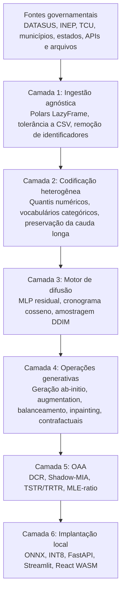
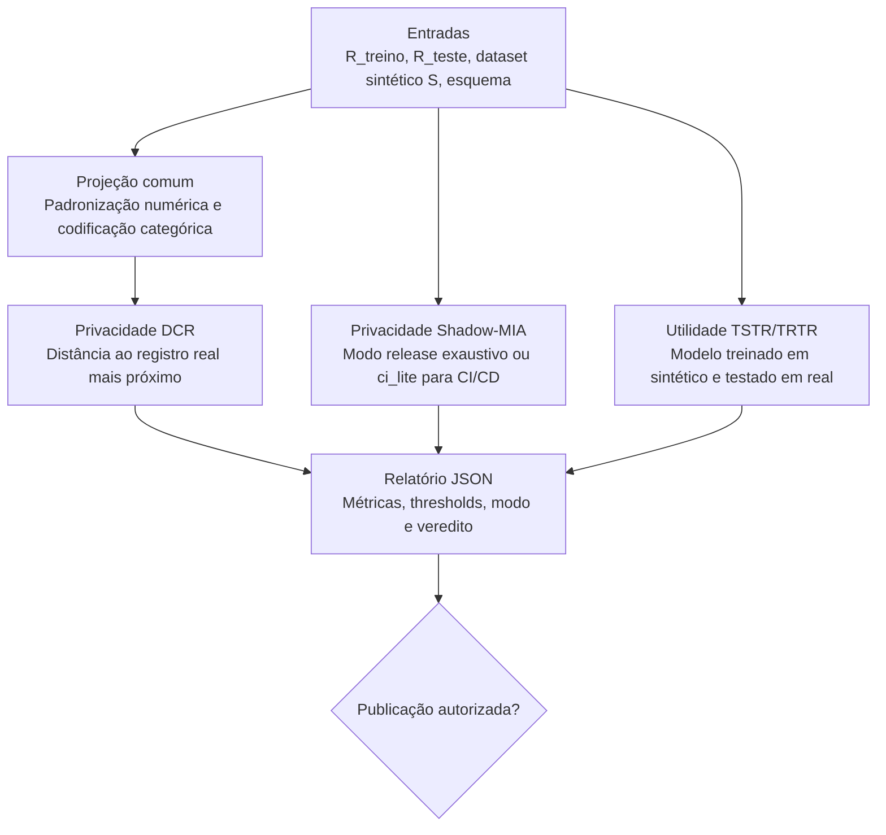

# DATALUS: Arquitetura de Difusão Tabular para Utilidade e Segurança Local

## Sumário

- [Resumo Executivo](#resumo-executivo)
- [Motivação Científica e Institucional](#motivação-científica-e-institucional)
- [Requisitos de Sistema](#requisitos-de-sistema)
- [Arquitetura em Seis Camadas](#arquitetura-em-seis-camadas)
- [Capacidades Generativas](#capacidades-generativas)
- [Robustez para Dados Públicos Brasileiros](#robustez-para-dados-públicos-brasileiros)
- [Fundamentos Matemáticos](#fundamentos-matemáticos)
- [Orquestrador Autônomo De Auditoria](#orquestrador-autônomo-de-auditoria)
- [Instalação e Uso](#instalação-e-uso)
- [Cheatsheet Completo da CLI](#cheatsheet-completo-da-cli)
- [Ciclo de Treinamento e Restrições do Colab](#ciclo-de-treinamento-e-restrições-do-colab)
- [Detalhes de Inferência e Arquitetura do Modelo](#detalhes-de-inferência-e-arquitetura-do-modelo)
- [Serviço FastAPI de Artefatos](#serviço-fastapi-de-artefatos)
- [Implantação com Docker](#implantação-com-docker)
- [CI/CD e Testes Automatizados](#cicd-e-testes-automatizados)
- [Governança de Dados, Ética e LGPD](#governança-de-dados-ética-e-lgpd)
- [Troubleshooting e FAQ](#troubleshooting-e-faq)
- [Prova de Conceito DATASUS](#prova-de-conceito-datasus)
- [Contribuição ao Bem Comum](#contribuição-ao-bem-comum)
- [Referências Fundamentais](#referências-fundamentais)
- [Licença](#licença)
- [Como Citar](#como-citar)

## Resumo Executivo

DATALUS (Diffusion-Augmented Tabular Architecture for Local Utility and Security) é um framework de Inteligência Artificial Generativa para produzir microdados tabulares sintéticos a partir de bases governamentais sensíveis. O projeto foi concebido para enfrentar o paradoxo entre a Lei Geral de Proteção de Dados (LGPD) e a Ciência Aberta: o Estado brasileiro possui bases de alto valor científico, mas a granularidade que torna esses dados úteis também pode torná-los juridicamente sensíveis.

A proposta não é mascarar, suprimir ou generalizar registros reais. O DATALUS aprende a distribuição probabilística conjunta dos dados e gera novos registros sintéticos, estatisticamente úteis e empiricamente auditados quanto ao risco de memorização. O sistema é, portanto, uma plataforma de IA Generativa para o bem comum: permite pesquisa, treinamento de modelos, simulação de políticas públicas e democratização de acesso a dados sem expor registros de cidadãos.

O DATALUS deve ser tratado como uma cadeia operacional completa: ingestão com Polars, codificação heterogênea, treinamento TabDDPM híbrido, checkpoints determinísticos, operações generativas, auditoria autônoma, exportação ONNX, quantização INT8, serviço FastAPI, interface Streamlit e inferência local no navegador com ONNX Runtime Web.

## Motivação Científica e Institucional

O Brasil possui uma política de dados abertos consolidada por instrumentos como a Lei de Acesso à Informação e a Infraestrutura Nacional de Dados Abertos. O portal [dados.gov.br](https://dados.gov.br) organiza a descoberta de bases públicas de diferentes órgãos e setores. Entretanto, bases com microdados de saúde, educação, orçamento, segurança pública e assistência social frequentemente envolvem dados pessoais ou sensíveis. A publicação irrestrita desses dados pode violar a LGPD, enquanto sua retenção excessiva reduz reprodutibilidade científica, inovação pública e avaliação independente de políticas.

O DATALUS propõe uma terceira via tecnicamente verificável: publicar dados sintéticos somente quando um Orquestrador Autônomo de Auditoria (OAA) demonstrar, por métricas quantitativas, que o artefato preserva utilidade estatística e reduz risco de inferência de pertencimento.

## Requisitos de Sistema

| Camada | Mínimo | Recomendado | Observações |
| --- | --- | --- | --- |
| Python | 3.11 | 3.11 ou superior | O `pyproject.toml` declara `requires-python >=3.11`. |
| GPU de treinamento | CPU para testes | NVIDIA T4 com 15 GB de VRAM ou superior | O Google Colab T4 é o ambiente restrito de referência. |
| RAM | 8 GB | 16 GB ou mais | A ingestão é lazy, mas codificação e auditoria podem demandar memória. |
| Navegador | Chromium, Firefox ou Edge moderno | Navegador com WebAssembly e Cache API | O componente React executa `onnxruntime-web` localmente. |
| Node.js | 20 no CI | 20 LTS | O pipeline frontend usa Node 20. |
| Docker | Compose v2 | Docker Engine com plugin Compose | O Compose sobe FastAPI e Streamlit. |

Extras do pacote:

| Extra | Finalidade |
| --- | --- |
| `training` | PyTorch, ONNX, ONNX Runtime e ONNX Script. |
| `test` | Pytest e HTTPX. |
| `frontend` | Streamlit. |
| `audit` | LightGBM e CatBoost para experimentos de auditoria mais pesados. |
| `dev` | Ambiente local completo. |

## Arquitetura em Seis Camadas



A arquitetura segue Clean Architecture com layout `src/datalus`: o domínio contém apenas contratos e matemática independentes de framework; a infraestrutura contém Polars, PyTorch, ONNX, checkpointing e codificação; a camada de aplicação coordena treinamento, inferência e auditoria; as interfaces expõem CLI e FastAPI.

```text
src/datalus/
  domain/            Schemas e matemática de difusão sem dependência de framework
  infrastructure/    Polars, PyTorch, ONNX, checkpointing e codificação
  application/       Casos de uso de treino, inferência, auditoria e exportação
  interfaces/        CLI Typer e FastAPI
frontend/
  streamlit/         Interface Streamlit em português brasileiro
  component/         Componente React TypeScript com ONNX Runtime Web
tests/               Testes unitários e de integração
docker/              Dockerfiles da API e do Streamlit
.github/workflows/   CI de Python, frontend e Docker
```

## Capacidades Generativas

O DATALUS deve ser avaliado como ecossistema de IA Generativa, não como ferramenta de anonimização. As capacidades expostas são:

| Capacidade | Finalidade | CLI |
| --- | --- | --- |
| Geração ab-initio | Criar novo dataset sintético a partir da distribuição aprendida. | `datalus sample` |
| Aumento de dados | Anexar linhas sintéticas a uma base pequena. | `datalus augment` |
| Balanceamento | Gerar registros para aproximar contagens de classes-alvo. | `datalus balance` |
| Inpainting tabular | Preencher campos nulos preservando campos observados. | `datalus inpaint` |
| Modificação contrafactual | Aplicar intervenções em colunas e regenerar registros compatíveis. | `datalus counterfactual` |
| Auditoria autônoma | Avaliar privacidade e utilidade antes da publicação. | `datalus audit` |
| Exportação para borda | Exportar pesos EMA para ONNX e INT8 opcional. | `datalus export-onnx` |
| Serviço de artefatos | Disponibilizar artefatos para inferência local no navegador. | `datalus serve` |

A lógica de Classifier-Free Guidance está implementada na camada de difusão. No caminho atual de treinamento padrão, o denoiser é instanciado sem vetor de contexto; portanto, `cfg_scale=1.0` representa o caminho incondicional e outros valores só têm efeito em modelos com contexto. A exportação ONNX ainda registra paridade INT8 sob amplificação `cfg_scale=3.0`, pois esse é o modo correto de proteger artefatos quando guidance for habilitado.

## Robustez para Dados Públicos Brasileiros

Bases do ecossistema [dados.gov.br](https://dados.gov.br) apresentam heterogeneidade real: CSV com delimitadores diferentes, codificações legadas, colunas esparsas, códigos de alta cardinalidade, pequenos municípios, eventos raros e mudanças de esquema entre anos. O DATALUS responde a esse cenário com políticas explícitas.

Primeiro, a ingestão usa Polars LazyFrame para evitar estouro de memória em ambientes como Google Colab e servidores públicos modestos. Segundo, identificadores diretos ou quase diretos são removidos antes do treinamento. Terceiro, categorias raras observadas são preservadas como tokens próprios. Essa decisão é essencial para justiça estatística: uma doença rara, um município pequeno ou um procedimento hospitalar infrequente não pode ser apagado por uma codificação agressiva em `UNKNOWN`.

## Fundamentos Matemáticos

### Cronograma Cosseno Implementado

O domínio implementa o cronograma cosseno de Nichol-Dhariwal com clipping numérico. Para horizonte de treinamento $T$ e deslocamento $s=0.008$:

$$
f(t)=\cos^2\left(\frac{t/T+s}{1+s}\frac{\pi}{2}\right)
$$

A acumulação normalizada é:

$$
\bar{\alpha}_t=\frac{f(t)}{f(0)}
$$

O beta de cada passo é:

$$
\beta_t=\text{clip}\left(1-\frac{\bar{\alpha}_{t+1}}{\bar{\alpha}_t},10^{-5},0.999\right)
$$

`VarianceSchedule` converte esses valores em tensores para $\beta_t$, $\alpha_t=1-\beta_t$, $\bar{\alpha}_t$, $\sqrt{\bar{\alpha}_t}$ e $\sqrt{1-\bar{\alpha}_t}$. Há também cronograma linear para ablação e testes.

### Processo Forward

O modelo de difusão define uma cadeia de Markov que corrompe progressivamente o vetor tabular latente $\mathbf{x}_0\in\mathbb{R}^d$:

$$
q(\mathbf{x}_t\mid\mathbf{x}_{t-1})=\mathcal{N}\left(\mathbf{x}_t;\sqrt{1-\beta_t}\mathbf{x}_{t-1},\beta_t\mathbf{I}\right)
$$

A forma fechada permite amostrar qualquer passo diretamente:

$$
q(\mathbf{x}_t\mid\mathbf{x}_0)=\mathcal{N}\left(\mathbf{x}_t;\sqrt{\bar{\alpha}_t}\mathbf{x}_0,(1-\bar{\alpha}_t)\mathbf{I}\right)
$$

A operação tensorial implementada em `q_sample` é:

$$
\mathbf{x}_t=\sqrt{\bar{\alpha}_t}\mathbf{x}_0+\sqrt{1-\bar{\alpha}_t}\boldsymbol{\epsilon},\quad\boldsymbol{\epsilon}\sim\mathcal{N}(\mathbf{0},\mathbf{I})
$$

### Processo Reverso e Perda Implementada

A rede denoiser aprende a predizer o ruído $\boldsymbol{\epsilon}_{\theta}$. O processo reverso probabilístico é:

$$
p_{\theta}(\mathbf{x}_{t-1}\mid\mathbf{x}_t)=\mathcal{N}\left(\mathbf{x}_{t-1};\boldsymbol{\mu}_{\theta}(\mathbf{x}_t,t),\boldsymbol{\Sigma}_{\theta}(\mathbf{x}_t,t)\right)
$$

O objetivo atualmente implementado por `TabularDiffusion.compute_loss` é a perda simplificada de predição de ruído:

$$
\mathcal{L}_{\mathrm{MSE}}=\mathbb{E}_{t,\mathbf{x}_0,\boldsymbol{\epsilon}}\left[\left\lVert\boldsymbol{\epsilon}-\boldsymbol{\epsilon}_{\theta}\left(\sqrt{\bar{\alpha}_t}\mathbf{x}_0+\sqrt{1-\bar{\alpha}_t}\boldsymbol{\epsilon},t\right)\right\rVert_2^2\right]
$$

Para extensões com logits categóricos explícitos, a formulação TabDDPM composta é:

$$
\mathcal{L}_{\mathrm{total}}=\lambda_{\mathrm{num}}\mathcal{L}_{\mathrm{MSE}}^{\mathrm{num}}+\lambda_{\mathrm{cat}}\mathcal{L}_{\mathrm{CE}}^{\mathrm{cat}}
$$

No estado atual do código, categorias são projetadas para fatias contínuas por embeddings aprendidos, e a difusão otimiza MSE sobre todo o vetor latente. Não há cabeça categórica separada com entropia cruzada.

### DDIM

A amostragem DDIM usa uma subsequência determinística descendente. Cada passo calcula:

$$
\hat{\mathbf{x}}_0=\frac{\mathbf{x}_t-\sqrt{1-\bar{\alpha}_t}\boldsymbol{\epsilon}_{\theta}(\mathbf{x}_t,t)}{\sqrt{\bar{\alpha}_t}}
$$

Quando $\eta>0$, o termo de variância é:

$$
\sigma_t=\eta\sqrt{\left(\frac{1-\bar{\alpha}_{t-1}}{1-\bar{\alpha}_t}\right)\left(1-\frac{\bar{\alpha}_t}{\bar{\alpha}_{t-1}}\right)}
$$

A atualização é:

$$
\mathbf{x}_{t-1}=\sqrt{\bar{\alpha}_{t-1}}\hat{\mathbf{x}}_0+\sqrt{1-\bar{\alpha}_{t-1}-\sigma_t^2}\boldsymbol{\epsilon}_{\theta}(\mathbf{x}_t,t)+\sigma_t\boldsymbol{\epsilon}
$$

Na CLI atual, $\eta=0$, logo $\sigma_t=0$ e a amostragem é determinística para uma semente fixa. A convenção final da implementação usa `prev_t=-1` como $\bar{\alpha}_{-1}=1$.

### Classifier-Free Guidance

Com contexto, a orientação condicional sem classificador externo é:

$$
\tilde{\boldsymbol{\epsilon}}_{\theta}(\mathbf{x}_t,\mathbf{c},t)=\boldsymbol{\epsilon}_{\theta}(\mathbf{x}_t,\varnothing,t)+w\left[\boldsymbol{\epsilon}_{\theta}(\mathbf{x}_t,\mathbf{c},t)-\boldsymbol{\epsilon}_{\theta}(\mathbf{x}_t,\varnothing,t)\right]
$$

A implementação retorna a predição direta do denoiser quando `context is None` ou `cfg_scale == 1.0`. Há também uma extensão por grupos que aplica máscaras e escalas sobre dimensões de contexto.

### RePaint Tabular

Para campos observados, o algoritmo recoloca a versão corretamente ruidificada em cada passo:

$$
\mathbf{x}_{t}^{\mathrm{obs}}=\sqrt{\bar{\alpha}_t}\mathbf{x}_0^{\mathrm{obs}}+\sqrt{1-\bar{\alpha}_t}\boldsymbol{\epsilon}
$$

A fusão com campos gerados segue:

$$
\mathbf{x}_t=\mathbf{m}\odot\mathbf{x}_{t}^{\mathrm{obs}}+(1-\mathbf{m})\odot\mathbf{x}_{t}^{\mathrm{gen}}
$$

O jump-back implementado por `undo_step` reinsere ruído entre dois timesteps:

$$
\mathbf{x}_{\mathrm{jump}}=\sqrt{\frac{\bar{\alpha}_{\mathrm{to}}}{\bar{\alpha}_{\mathrm{from}}}}\mathbf{x}_{\mathrm{from}}+\sqrt{1-\frac{\bar{\alpha}_{\mathrm{to}}}{\bar{\alpha}_{\mathrm{from}}}}\boldsymbol{\epsilon}
$$

## Orquestrador Autônomo de Auditoria



### Espaço de Projeção

O OAA projeta dados reais e sintéticos para um espaço comum do sklearn. Colunas numéricas são padronizadas. Colunas categóricas e booleanas são codificadas por one-hot com `handle_unknown="ignore"`. Colunas removidas, coluna-alvo e colunas ausentes em qualquer frame são excluídas da projeção de privacidade.

### DCR

A Distance to Closest Record mede proximidade entre registros sintéticos e reais:

$$
\mathrm{DCR}(\hat{\mathbf{x}}_i)=\min_{j\in\{1,\ldots,N\}}d(\hat{\mathbf{x}}_i,\mathbf{x}_j^{\mathrm{real}})
$$

O limiar de alerta é o percentil configurado da distância ao segundo vizinho real mais próximo:

$$
\tau_{\mathrm{DCR}}=\text{percentile}_{p}\left(\left\{d_2(\mathbf{x}_j^{\mathrm{real}},R_{\mathrm{treino}})\right\}_{j=1}^{N}\right)
$$

A razão memorística é:

$$
\rho_{\mathrm{mem}}=\frac{1}{M}\sum_{i=1}^{M}\mathbf{1}\left[\mathrm{DCR}(\hat{\mathbf{x}}_i)<\tau_{\mathrm{DCR}}\right]
$$

A aprovação padrão exige $\rho_{\mathrm{mem}}<0.01$ com percentil DCR $p=1.0$.

### Shadow-MIA

O ataque de inferência de pertencimento estima se um registro real participou do treinamento. O DATALUS constrói atributos de ataque por vizinhança entre candidatos e dados gerados:

$$
\phi(\mathbf{x})=\left[d_{\min}(\mathbf{x},S),\overline{d}_k(\mathbf{x},S),\text{std}_k(\mathbf{x},S),\frac{d_{\min}(\mathbf{x},S)}{\max(\overline{d}_k(\mathbf{x},S),10^{-8})}\right]
$$

Um RandomForest aprende escores de pertencimento. O indicador central é:

$$
\mathrm{AUC}_{\mathrm{MIA}}=\Pr\left(s_{\mathrm{membro}}>s_{\mathrm{nao\_membro}}\right)
$$

O modo `release` preserva a configuração integral. O modo `ci_lite` aplica limites determinísticos: no máximo dois modelos sombra, multiplicador sintético até `0.5`, até três vizinhos, máximo padrão de 512 linhas, até 50 árvores, profundidade máxima 6 e folha mínima pelo menos 2. Ele é ferramenta de regressão, não substituto do laudo oficial.

### Utilidade TSTR

A razão MLE compara utilidade preditiva sintética e real:

$$
\mathrm{MLE}_{\mathrm{ratio,AUC}}=\frac{\mathrm{AUC}_{\mathrm{TSTR}}}{\mathrm{AUC}_{\mathrm{TRTR}}}
$$

A implementação também reporta:

$$
\mathrm{MLE}_{\mathrm{ratio,F1}}=\frac{\mathrm{F1}_{\mathrm{TSTR}}}{\mathrm{F1}_{\mathrm{TRTR}}}
$$

O limiar padrão de aprovação é $\mathrm{MLE}_{\mathrm{ratio,AUC}}\geq0.90$.

## Instalação e Uso

### Ambiente Python

Use Python 3.11 ou superior. Em sistemas com Python gerenciado pelo sistema operacional, crie um ambiente virtual local:

```bash
python -m venv .venv
.venv/bin/python -m pip install --upgrade pip
.venv/bin/python -m pip install -e '.[dev]'
```

Instalações mais específicas:

```bash
.venv/bin/python -m pip install -e '.[training,test]'
.venv/bin/python -m pip install -e '.[frontend]'
```

O arquivo `requirements.txt` é apenas compatibilidade; a fonte autoritativa de dependências é `pyproject.toml`.

### Build do Frontend

O Streamlit usa o bundle React em `frontend/component/dist`. Se esse bundle não existir, o wrapper aponta para o servidor Vite em `http://localhost:5173`.

```bash
cd frontend/component
npm ci
npm run test
npm run build
```

Modo de desenvolvimento:

```bash
cd frontend/component
npm run dev
```

Em outro terminal:

```bash
.venv/bin/datalus streamlit
```

### Fluxo Completo

```bash
datalus ingest raw.csv artifacts/demo/processed.parquet --schema-path artifacts/demo/schema_config.json --target-column target
datalus train artifacts/demo/schema_config.json artifacts/demo/processed.parquet artifacts/demo --epochs 5 --batch-size 2048
datalus sample artifacts/demo/checkpoints/checkpoint_latest.pt artifacts/demo/encoder_config.json artifacts/demo/synthetic.parquet --n-records 10000 --ddim-steps 50 --cfg-scale 1.0
datalus audit real_train.parquet artifacts/demo/synthetic.parquet artifacts/demo/schema_config.json artifacts/demo/audit_report.json --target-column target --mia-mode release
datalus export-onnx artifacts/demo/checkpoints/checkpoint_latest.pt artifacts/demo/encoder_config.json artifacts/demo --quantize
datalus serve artifacts --host 0.0.0.0 --port 8000
```

### Verificação Local

```bash
.venv/bin/python -m pytest -q
cd frontend/component
npm run test
npm run build
```

## Cheatsheet Completo da CLI

A Interface de Linha de Comando (CLI) está em `src/datalus/interfaces/cli.py` e apenas encaminha argumentos para casos de uso da aplicação.

### Resumo dos Comandos

| Comando | Finalidade | Saída principal |
| --- | --- | --- |
| `ingest` | Inferir esquema e materializar Parquet seguro. | `schema_config.json` e Parquet processado. |
| `train` | Treinar difusão com checkpoint determinístico. | `encoder_config.json` e `checkpoint_latest.pt`. |
| `sample` | Gerar dataset sintético ab-initio. | Parquet sintético. |
| `augment` | Anexar registros sintéticos a dataset existente. | Parquet aumentado. |
| `balance` | Gerar registros para contagens de classes solicitadas. | Parquet balanceado. |
| `inpaint` | Preencher nulos por máscaras RePaint. | Parquet preenchido. |
| `counterfactual` | Aplicar intervenções e regenerar campos compatíveis. | Parquet contrafactual. |
| `audit` | Executar DCR, Shadow-MIA e utilidade quando houver alvo. | Relatório JSON. |
| `export-onnx` | Exportar denoiser EMA para ONNX e INT8 opcional. | ONNX e manifest. |
| `serve` | Servir artefatos para inferência local no navegador. | Serviço FastAPI. |
| `streamlit` | Abrir a interface Streamlit em português. | Serviço Streamlit. |

### Argumentos, Flags e Defaults

| Comando | Argumentos posicionais | Opções e defaults | Saída esperada |
| --- | --- | --- | --- |
| `ingest` | `input_path`, `output_path` | `--schema-path artifacts/schema_config.json`, `--target-column None` | Grava schema e Parquet Snappy. |
| `train` | `schema_path`, `data_path`, `output_dir` | `--epochs 1`, `--batch-size 2048`, `--max-steps None`, `--resume-from None` | Grava encoder e checkpoints em `output_dir/checkpoints`. |
| `sample` | `checkpoint_path`, `encoder_path`, `output_path` | `--n-records 100`, `--ddim-steps 50`, `--seed 42`, `--cfg-scale 1.0` | Grava Parquet sintético. |
| `augment` | `checkpoint_path`, `encoder_path`, `input_path`, `output_path` | `--n-records 100`, `--ddim-steps 50`, `--seed 42`, `--cfg-scale 1.0` | Grava registros originais mais sintéticos. |
| `balance` | `checkpoint_path`, `encoder_path`, `input_path`, `output_path`, `target_column`, `target_distribution_json` | `--ddim-steps 50`, `--seed 42`, `--cfg-scale 1.0`, `--max-attempts 10`, `--strict False` | Grava Parquet aproximando contagens solicitadas. |
| `inpaint` | `checkpoint_path`, `encoder_path`, `input_path`, `output_path` | `--ddim-steps 50`, `--jump-length 10`, `--jump-n-sample 10`, `--seed 42` | Grava Parquet com nulos preenchidos. |
| `counterfactual` | `checkpoint_path`, `encoder_path`, `input_path`, `output_path`, `intervention_json` | `--ddim-steps 50`, `--seed 42` | Grava Parquet sob intervenções fixas. |
| `audit` | `real_train_path`, `synthetic_path`, `schema_path`, `report_path` | `--target-column None`, `--real-holdout-path None`, `--mia-mode release`, `--max-audit-rows None` | Grava relatório JSON de privacidade e, se aplicável, utilidade. |
| `export-onnx` | `checkpoint_path`, `encoder_path`, `output_dir` | `--quantize True` | Grava `model_fp32.onnx`, `model_int8.onnx`, configs e manifest. |
| `serve` | `registry_path` com default `artifacts` | `--host 0.0.0.0`, `--port 8000` | Inicia Uvicorn com `DATALUS_REGISTRY_PATH`. |
| `streamlit` | Nenhum | Nenhuma | Executa `streamlit run frontend/streamlit/app.py`. |

### Observações Operacionais

- `ingest` suporta `.csv`, `.tsv`, `.csv.gz`, `.tsv.gz`, `.parquet` e `.orc`; ORC requer `pyarrow`.
- `ingest` usa detecção de delimitador para CSV, fallback para ponto e vírgula em exports brasileiros ambíguos, decodificação `utf8-lossy`, `infer_schema_length=10000`, `ignore_errors=True` e `truncate_ragged_lines=True`.
- `ingest` remove colunas esparsas acima de `0.95` de nulos, identificadores, texto livre e tipos sem suporte.
- Os defaults internos de `ZeroShotPreprocessor` são `high_cardinality_threshold=50`, `sample_size=100000`, `rare_category_threshold=5` e tokens nulos `""`, `NA`, `N/A`, `null`, `NULL` e `None`. A coluna-alvo é protegida das regras de remoção por esparsidade e identificador.
- `train` expõe pela CLI os parâmetros essenciais; learning rate, weight decay, hidden dimensions, AMP, EMA e warmup existem em `TrainingConfig` para uso programático.
- `balance` compara rótulos como strings, então distribuições para classes numéricas devem usar chaves JSON como `{"0": 5000}`.
- `counterfactual` só aceita colunas retidas pelo encoder. Categorias inéditas viram `__UNKNOWN__`.
- `serve` serve artefatos e não ativa geração PyTorch no servidor por padrão.

## Ciclo de Treinamento e Restrições do Colab

### Ciclo de Vida

1. `ingest` cria Parquet retido e `schema_config.json`.
2. `DatalusTrainer` carrega o schema e constrói offsets determinísticos de batches.
3. `TabularEncoder` ajusta quantis numéricos e vocabulários categóricos em até `max_encoder_fit_rows=100000`.
4. `FeatureProjector` concatena fatias numéricas e embeddings categóricos.
5. `TabularDenoiserMLP` prediz ruído no vetor latente completo.
6. `TabularDiffusion.compute_loss` sorteia timesteps e otimiza MSE.
7. AdamW atualiza parâmetros da difusão e do projetor.
8. Aquecimento linear antecede `CosineAnnealingLR` até `eta_min=1e-6`.
9. AMP GradScaler é usado em CUDA quando `amp=True`.
10. Gradientes são clipados com `max_grad_norm=1.0`.
11. EMA acompanha parâmetros da difusão com decaimento `0.9999`.
12. Checkpoints preservam estado suficiente para retomada determinística.

### Defaults de Treinamento

| Parâmetro | Default |
| --- | --- |
| `batch_size` | `2048` |
| `epochs` | `1` |
| `learning_rate` | `2e-4` |
| `weight_decay` | `1e-4` |
| `checkpoint_every_steps` | `500` |
| `seed` | `42` |
| `num_timesteps` | `1000` |
| `hidden_dims` | `(512, 1024, 1024, 512)` |
| `amp` | `True` |
| `condition_dropout` | `0.1` |
| `ema_decay` | `0.9999` |
| `warmup_steps` | `500` |
| `max_grad_norm` | `1.0` |
| `max_encoder_fit_rows` | `100000` |

### Checkpointing Determinístico

Cada checkpoint inclui estados da difusão, projetor, otimizador, scheduler, AMP scaler, EMA, época, índice de batch, `global_step`, perda, histórico de perdas, configuração, hash SHA-256 e estados RNG de Python, NumPy, Torch e CUDA quando disponível.

Retomada:

```bash
datalus train artifacts/demo/schema_config.json artifacts/demo/processed.parquet artifacts/demo --epochs 20 --batch-size 1024 --resume-from artifacts/demo/checkpoints/checkpoint_latest.pt
```

### Google Colab T4

O Colab T4 é adequado para prova de conceito, mas deve ser tratado como ambiente preemptível. Monte o Google Drive e grave todos os artefatos fora do disco temporário:

```python
from google.colab import drive
drive.mount('/content/drive')
```

Layout recomendado:

```text
/content/drive/MyDrive/datalus/
  raw/
  processed/
  artifacts/
    datasus_sih/
      schema_config.json
      encoder_config.json
      checkpoints/
```

Smoke test:

```bash
python -m pip install --upgrade pip
python -m pip install -e '.[training,test]'
datalus train /content/drive/MyDrive/datalus/artifacts/datasus_sih/schema_config.json /content/drive/MyDrive/datalus/processed/train.parquet /content/drive/MyDrive/datalus/artifacts/datasus_sih --epochs 1 --batch-size 2048 --max-steps 20
```

Ajuste de batch:

| Sintoma | Ação |
| --- | --- |
| OOM antes do primeiro checkpoint | Repetir com `--batch-size 1024`. |
| OOM depois de alguns passos | Retomar de `checkpoint_latest.pt` e reduzir para `512`. |
| OOM com muitas categorias de alta cardinalidade | Reduzir para `256` ou revisar colunas retidas. |
| Interrupção de sessão | Retomar pelo checkpoint salvo no Drive. |

## Detalhes de Inferência e Arquitetura do Modelo

### Transformações Numéricas por Quantis

Cada coluna numérica ajusta até 1.000 quantis empíricos. A transformação mapeia valores finitos para o domínio quantílico e depois para `[-1, 1]`. Valores não finitos usam a mediana de treino. A inversa clipeia valores gerados para `[0, 1]` no espaço de quantis e interpola pela tabela persistida.

### Vocabulários e Embeddings Categóricos

Cada coluna categórica guarda `__UNKNOWN__` no índice 0, `__NULL__` no índice 1, todas as categorias observadas ordenadas, frequências e contagem de raras. Categorias raras observadas continuam endereçáveis. A dimensão padrão do embedding é `ceil(log2(cardinality))`, com mínimo 2.

### MLP Residual Denoiser

O `TabularDenoiserMLP` usa embedding sinusoidal de tempo, projeção MLP temporal, projeção opcional de contexto, projeção de entrada, blocos residuais com Linear, LayerNorm, injeção temporal, SiLU, Dropout, Linear e LayerNorm, além de cabeça final LayerNorm, SiLU e Linear para retornar à dimensão latente. A camada final é inicializada com pesos e bias zero.

### Inferência Python

`load_model_bundle` reconstrói encoder, projetor, denoiser e difusão a partir de checkpoint. A amostragem cria ruído gaussiano, executa DDIM, separa fatias numéricas e categóricas, inverte quantis numéricos e decodifica categorias por embedding aprendido mais próximo.

### Inferência no Navegador

O componente React opera sem PyTorch no servidor:

1. Streamlit envia schema, encoder, projector, manifest, semente, número de registros, passos DDIM e precisão.
2. O componente baixa `model_int8.onnx` ou `model_fp32.onnx`.
3. O Cache API do navegador armazena os bytes ONNX.
4. ONNX Runtime Web cria sessão WASM.
5. TypeScript inicializa ruído gaussiano determinístico.
6. DDIM chama o denoiser ONNX a cada passo.
7. A decodificação usa `encoder_config.json` e `projector_config.json`.
8. Os registros retornam ao Streamlit via `streamlit-component-lib`.

### Artefatos ONNX e INT8

```text
artifacts/<dominio>/
  model_fp32.onnx
  model_int8.onnx
  encoder_config.json
  projector_config.json
  manifest.json
```

O grafo ONNX usa entradas `x_t` e `timestep`, saída `predicted_noise`, opset 17 e batch dinâmico. A quantização INT8 usa quantização dinâmica do ONNX Runtime. O manifest contém paridade FP32 e paridade INT8 com amplificação CFG.

## Serviço FastAPI de Artefatos

```bash
datalus serve artifacts --host 0.0.0.0 --port 8000
```

Endpoints principais:

| Endpoint | Método | Finalidade |
| --- | --- | --- |
| `/health` | `GET` | Status, uptime e registry. |
| `/artifacts` | `GET` | Lista domínios de artefatos. |
| `/artifacts/{domain}/manifest` | `GET` | Retorna `manifest.json`. |
| `/artifacts/{domain}/schema` | `GET` | Retorna `schema_config.json`. |
| `/artifacts/{domain}/{file_name}` | `GET` | Serve arquivos permitidos. |
| `/audit/latest` | `GET` | Retorna o audit report mais recente. |
| `/generate` | `POST` | Geração no servidor quando habilitada explicitamente. |
| `/augment` | `POST` | Augmentation no servidor quando habilitada. |
| `/balance` | `POST` | Balanceamento no servidor quando habilitado. |
| `/inpaint` | `POST` | Inpainting no servidor quando habilitado. |
| `/counterfactual` | `POST` | Contrafactual no servidor quando habilitado. |

Por padrão, geração PyTorch no servidor é desabilitada. Se `/generate` retornar `403`, o serviço está no modo pretendido de distribuição de artefatos para inferência local no navegador. O CORS atualmente permite todas as origens para `GET` e `POST`, o que é conveniente em demonstrações locais e deve ser restringido pelo proxy reverso ou pela fronteira de implantação em produção.

## Implantação com Docker

O Compose define dois serviços:

- `api`: FastAPI, construído por `docker/Dockerfile.api`.
- `streamlit`: Streamlit, construído por `docker/Dockerfile.streamlit`, incluindo build Node/NPM do componente React.

Subida:

```bash
docker compose up --build
```

Mapeamentos:

| Serviço | Porta | Volume |
| --- | --- | --- |
| `api` | `8000:8000` | `./artifacts:/app/artifacts:ro` |
| `streamlit` | `8501:8501` | `./artifacts:/app/artifacts:ro` |

Variáveis:

| Variável | Valor |
| --- | --- |
| `DATALUS_REGISTRY_PATH` | `/app/artifacts` |
| `DATALUS_ARTIFACT_BASE_URL` | `http://localhost:8000/artifacts` |

Layout esperado:

```text
artifacts/
  datasus_sih/
    manifest.json
    schema_config.json
    encoder_config.json
    projector_config.json
    model_fp32.onnx
    model_int8.onnx
    audit_report.json
```

Nota de segurança de produção: embora a API escute em `0.0.0.0:8000` e o Streamlit em `0.0.0.0:8501`, implantações reais no setor público devem colocar os containers atrás de proxy reverso como NGINX ou Traefik com HTTPS/TLS, controles de acesso, logs e segmentação de rede. Artefatos sintéticos derivados de bases sensíveis continuam exigindo distribuição controlada e criptografia em trânsito.

## CI/CD e Testes Automatizados

O GitHub Actions possui três jobs:

| Job | Ambiente | Comandos |
| --- | --- | --- |
| `python-tests` | Ubuntu, Python 3.11, Torch CPU | Instala `.[training,test]` e executa `pytest`. |
| `frontend-build` | Ubuntu, Node 20 | Executa `npm install`, `npm run test`, `npm run build`. |
| `docker-build` | Ubuntu Docker | Constrói imagens API e Streamlit. |

Dependabot está configurado para atualizações semanais do devcontainer. O devcontainer usa Debian com Python, Node e Docker-outside-of-Docker.

Os testes cobrem cronogramas de difusão, invariantes RePaint, checkpoint RNG, preprocessamento Polars, preservação de cauda longa, encoding reversível, Shadow-MIA `ci_lite`, serviço FastAPI, exportação ONNX, quantização INT8 e paridade sob amplificação CFG.

## Governança de Dados, Ética e LGPD

O DATALUS reduz risco de divulgação por síntese generativa e auditoria empírica, mas não é uma declaração jurídica automática de anonimização. A publicação deve permanecer vinculada à governança institucional, interpretação da LGPD e análise contextual de risco.

Requisitos operacionais:

- Não versionar dados brutos, Parquet processado, checkpoints, ONNX ou artefatos gerados.
- Remover identificadores diretos e revisar quasi-identificadores.
- Preservar categorias raras intencionalmente e auditar combinações raras geradas.
- Publicar dados sintéticos somente com relatório OAA, schema, proveniência e limitações.
- Usar `release` para evidência de publicação; usar `ci_lite` apenas para regressão.
- Aplicar HTTPS/TLS e controle de acesso nos serviços de artefatos.

## Troubleshooting e FAQ

### Ingestão Polars estoura memória

Prefira Parquet ou ORC quando disponíveis. Para CSVs muito largos, remova texto livre e identificadores antes da ingestão, divida arquivos por ano ou região, e use a API Python `ZeroShotPreprocessor(sample_size=...)` com amostra menor para inferência de schema.

### Treinamento no Colab T4 falha com CUDA OOM

Reduza batch size na ordem `1024`, `512`, `256`. Retome de `checkpoint_latest.pt`. Não aumente `hidden_dims` em T4. Colunas categóricas de alta cardinalidade ampliam embeddings e podem exigir redução de schema.

### Paridade ONNX INT8 CFG falha

Inspecione `manifest.json`. Se `amplified_max_abs_diff` exceder `0.2`, não publique o INT8. Use `model_fp32.onnx`, reexporte ou desabilite quantização com `--no-quantize`.

### OAA `ci_lite` falha no GitHub Actions

Verifique se real e sintético compartilham colunas retidas, se há pelo menos oito linhas úteis e se existe variação de classe para a tarefa de utilidade. Use `--max-audit-rows 512` para regressões. `ci_lite` não substitui auditoria `release`.

### Contrafactual falha por incompatibilidade de schema

As intervenções devem usar colunas retidas no `encoder_config.json`. Identificadores removidos e colunas sem suporte não podem ser fixados. Categorias inéditas viram `__UNKNOWN__` e podem reduzir validade semântica.

### `/generate` retorna `403`

Esse é o comportamento padrão. A geração no servidor é desabilitada para evitar dependência PyTorch no backend de distribuição. Use o componente ONNX no navegador ou habilite geração apenas em ambiente interno confiável.

### Streamlit não gera no navegador

Confirme `npm run build`, URL `DATALUS_ARTIFACT_BASE_URL`, existência de `manifest.json`, `encoder_config.json`, `projector_config.json`, ONNX selecionado e montagem `./artifacts:/app/artifacts:ro`.

## Prova de Conceito DATASUS

A prova de conceito proposta utiliza o SIH-SUS/DATASUS porque a base combina relevância científica, alta sensibilidade, codificação heterogênea e cauda longa. Diagnósticos raros, procedimentos de baixa frequência e municípios pequenos são justamente os casos nos quais dados sintéticos mal codificados poderiam produzir viés. Por isso, a preservação explícita da cauda longa é requisito técnico e ético do projeto.

Os critérios empíricos esperados são: baixo DCR memorístico, MIA ROC-AUC próximo de aleatoriedade, MLE-ratio superior a 0,90 para tarefa preditiva definida, estabilidade de distribuições marginais e capacidade de inferência local em CPU.

## Contribuição ao Bem Comum

O DATALUS contribui para a pesquisa brasileira em quatro dimensões: democratização do acesso a bases realistas, proteção técnica de dados pessoais, suporte à formulação de políticas públicas por simulação contrafactual e redução de dependência de infraestrutura cara. Sua proposta está alinhada ao tema Inteligência Artificial para o Bem Comum porque transforma IA generativa em infraestrutura pública auditável, reprodutível e orientada à proteção de direitos.

## Referências Fundamentais

- [Kotelnikov et al. TabDDPM: Modelling Tabular Data with Diffusion Models.](https://proceedings.mlr.press/v202/kotelnikov23a.html)
- [Lugmayr et al. RePaint: Inpainting using Denoising Diffusion Probabilistic Models.](https://openaccess.thecvf.com/content/CVPR2022/html/Lugmayr_RePaint_Inpainting_Using_Denoising_Diffusion_Probabilistic_Models_CVPR_2022_paper.html)
- [Ho and Salimans. Classifier-Free Diffusion Guidance.](https://arxiv.org/abs/2207.12598)
- [Song et al. Denoising Diffusion Implicit Models.](https://openreview.net/forum?id=St1giarCHLP)
- [Shokri et al. Membership Inference Attacks Against Machine Learning Models.](https://doi.org/10.1109/SP.2017.41)
- Governo Digital. [Dados Abertos](https://www.gov.br/governodigital/pt-br/dados-abertos/dados-abertos), [Portal Brasileiro de Dados Abertos](https://www.gov.br/governodigital/pt-br/dados-abertos/portal-brasileiro-de-dados-abertos) e [API do Portal de Dados Abertos](https://www.gov.br/conecta/catalogo/apis/api-portal-de-dados-abertos).

## Licença

O software é disponibilizado sob licença Apache 2.0. Este documento não contém dados pessoais. Os exemplos são ilustrativos e não representam registros reais de cidadãos brasileiros.

## Como Citar

Silva, Emanuel Lázaro Custódio. **DATALUS: Diffusion-Augmented Tabular Architecture for Local Utility and Security**. 2026. Software. Disponível em: <https://github.com/emanuellcs/datalus>. Acesso em: [dia] [mês]. [ano].
