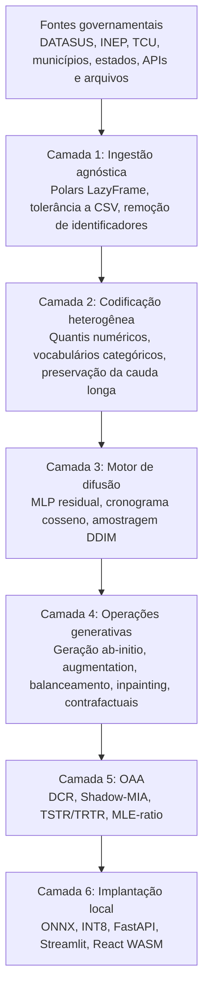
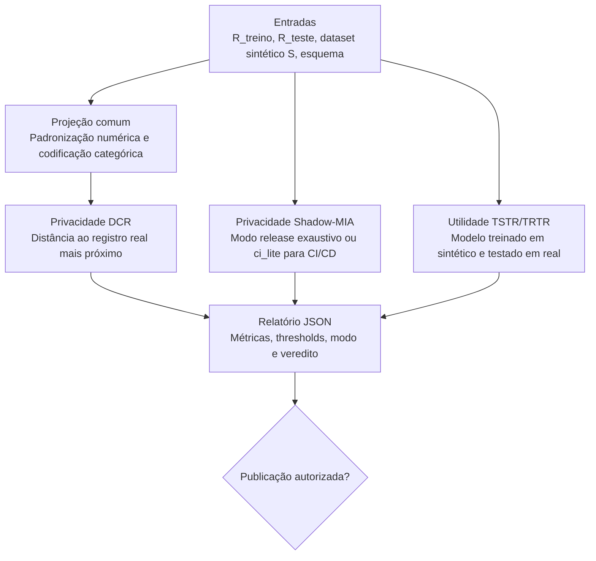

# DATALUS: Arquitetura de Difusão Tabular para Utilidade e Segurança Local

## Resumo Executivo

DATALUS (Diffusion-Augmented Tabular Architecture for Local Utility and Security) é um framework de Inteligência Artificial Generativa para produzir microdados tabulares sintéticos a partir de bases governamentais sensíveis. O projeto foi concebido para enfrentar o paradoxo entre a Lei Geral de Proteção de Dados (LGPD) e a Ciência Aberta: o Estado brasileiro possui bases de alto valor científico, mas a granularidade que torna esses dados úteis também pode torná-los juridicamente sensíveis.

A proposta não é mascarar, suprimir ou generalizar registros reais. O DATALUS aprende a distribuição probabilística conjunta dos dados e gera novos registros sintéticos, estatisticamente úteis e empiricamente auditados quanto ao risco de memorização. O sistema é, portanto, uma plataforma de IA Generativa para o bem comum: permite pesquisa, treinamento de modelos, simulação de políticas públicas e democratização de acesso a dados sem expor registros de cidadãos.

## Motivação Científica E Institucional

O Brasil possui uma política de dados abertos consolidada por instrumentos como a Lei de Acesso à Informação e a Infraestrutura Nacional de Dados Abertos. O portal [dados.gov.br](https://dados.gov.br) organiza a descoberta de bases públicas de diferentes órgãos e setores. Entretanto, bases com microdados de saúde, educação, orçamento, segurança pública e assistência social frequentemente envolvem dados pessoais ou sensíveis. A publicação irrestrita desses dados pode violar a LGPD, enquanto sua retenção excessiva reduz reprodutibilidade científica, inovação pública e avaliação independente de políticas.

O DATALUS propõe uma terceira via tecnicamente verificável: publicar dados sintéticos somente quando um Orquestrador Autônomo de Auditoria demonstrar, por métricas quantitativas, que o artefato preserva utilidade estatística e reduz risco de inferência de pertencimento.

## Arquitetura Em Seis Camadas



A arquitetura segue Clean Architecture com layout `src/datalus`: o domínio contém apenas contratos e matemática independentes de framework; a infraestrutura contém Polars, PyTorch e ONNX; a camada de aplicação coordena treinamento, inferência e auditoria; as interfaces expõem CLI e FastAPI.

## Capacidades Generativas

O DATALUS deve ser avaliado como ecossistema de IA Generativa, não como ferramenta de anonimização. As capacidades expostas são:

- Geração ab-initio: criação de um novo dataset sintético a partir da distribuição aprendida.
- Aumento de dados: expansão de bases pequenas com registros sintéticos compatíveis.
- Balanceamento: geração seletiva para reduzir desequilíbrio de classes minoritárias.
- Inpainting tabular: preenchimento probabilístico de campos ausentes mantendo campos observados.
- Modificação contrafactual: intervenção em atributos específicos e regeneração coerente dos demais campos.
- Auditoria autônoma: avaliação formal de privacidade e utilidade antes de publicação.
- Implantação em borda: geração local em CPU, inclusive no navegador, por ONNX Runtime Web.

Essas funções são acessíveis por CLI (`sample`, `augment`, `balance`, `inpaint`, `counterfactual`, `audit`, `export-onnx`) e por endpoints FastAPI equivalentes.

## Robustez Para Dados Públicos Brasileiros

Bases do ecossistema [dados.gov.br](https://dados.gov.br) apresentam heterogeneidade real: CSV com delimitadores diferentes, codificações legadas, colunas esparsas, códigos de alta cardinalidade, pequenos municípios, eventos raros e mudanças de esquema entre anos. O DATALUS responde a esse cenário com três políticas.

Primeiro, a ingestão usa Polars LazyFrame para evitar estouro de memória em ambientes como Google Colab e servidores públicos modestos. Segundo, identificadores diretos ou quase diretos são removidos antes do treinamento. Terceiro, categorias raras observadas são preservadas como tokens próprios. Essa decisão é essencial para justiça estatística: uma doença rara, um município pequeno ou um procedimento hospitalar infrequente não pode ser apagado por uma codificação agressiva em `UNKNOWN`.

## Fundamentos Matemáticos

### Processo Forward

O modelo de difusão define uma cadeia de Markov que corrompe progressivamente o vetor tabular latente $\mathbf{x}_0$:

$$
q(\mathbf{x}_t \mid \mathbf{x}_{t-1}) =
\mathcal{N}\left(\mathbf{x}_t;\sqrt{1-\beta_t}\mathbf{x}_{t-1},\beta_t\mathbf{I}\right).
$$

A forma fechada permite amostrar qualquer passo diretamente:

$$
q(\mathbf{x}_t \mid \mathbf{x}_0)=
\mathcal{N}\left(\mathbf{x}_t;\sqrt{\bar{\alpha}_t}\mathbf{x}_0,(1-\bar{\alpha}_t)\mathbf{I}\right),
\quad
\bar{\alpha}_t=\prod_{s=1}^{t}(1-\beta_s).
$$

### Processo Reverso E Perda Composta

A rede denoiser aprende a predizer o ruído:

$$
\mathcal{L}_{\mathrm{MSE}}=
\mathbb{E}\left[
\left\lVert
\boldsymbol{\epsilon}-\boldsymbol{\epsilon}_{\theta}(\mathbf{x}_t,t)
\right\rVert_2^2
\right].
$$

Para extensões com logits categóricos explícitos, a formulação TabDDPM completa é:

$$
\mathcal{L}_{\mathrm{total}}=
\lambda_{\mathrm{num}}\mathcal{L}_{\mathrm{MSE}}^{\mathrm{num}}
+
\lambda_{\mathrm{cat}}\mathcal{L}_{\mathrm{CE}}^{\mathrm{cat}}.
$$

### DDIM

A amostragem acelerada é dada por:

$$
\mathbf{x}_{t_{i-1}} =
\sqrt{\bar{\alpha}_{t_{i-1}}}
\left(
\frac{\mathbf{x}_{t_i}-\sqrt{1-\bar{\alpha}_{t_i}}\boldsymbol{\epsilon}_{\theta}(\mathbf{x}_{t_i},t_i)}
{\sqrt{\bar{\alpha}_{t_i}}}
\right)
+
\sqrt{1-\bar{\alpha}_{t_{i-1}}-\sigma_{t_i}^{2}}
\boldsymbol{\epsilon}_{\theta}(\mathbf{x}_{t_i},t_i)
+
\sigma_{t_i}\boldsymbol{\epsilon}.
$$

### Classifier-Free Guidance

A orientação condicional sem classificador externo é:

$$
\tilde{\boldsymbol{\epsilon}}_{\theta}=
\boldsymbol{\epsilon}_{\theta}(\mathbf{x}_t,\varnothing,t)
+w\left[
\boldsymbol{\epsilon}_{\theta}(\mathbf{x}_t,\mathbf{c},t)-
\boldsymbol{\epsilon}_{\theta}(\mathbf{x}_t,\varnothing,t)
\right].
$$

Como $w>1$ amplifica erro de ruído, a exportação INT8 registra teste de paridade em escala alta ($w\geq3$).

### RePaint Tabular

Para campos observados, o algoritmo recoloca a versão corretamente ruidificada em cada passo:

$$
\mathbf{x}_t^{\mathrm{obs}}=
\sqrt{\bar{\alpha}_t}\mathbf{x}_0^{\mathrm{obs}}
+
\sqrt{1-\bar{\alpha}_t}\boldsymbol{\epsilon}.
$$

A fusão com campos gerados segue:

$$
\mathbf{x}_t=\mathbf{m}\odot\mathbf{x}_t^{\mathrm{obs}}+(1-\mathbf{m})\odot\mathbf{x}_t^{\mathrm{gen}}.
$$

## Orquestrador Autônomo De Auditoria



### DCR

A Distance to Closest Record mede proximidade entre registros sintéticos e reais:

$$
\mathrm{DCR}(\hat{\mathbf{x}}_i)=
\min_j d(\hat{\mathbf{x}}_i,\mathbf{x}^{\mathrm{real}}_j).
$$

Valores concentrados próximos de zero indicam risco de memorização.

### Shadow-MIA

O ataque de inferência de pertencimento estima se um registro real participou do treinamento. O indicador central é:

$$
\mathrm{AUC}_{\mathrm{MIA}}=\Pr(s_{\mathrm{membro}}>s_{\mathrm{nao\_membro}}).
$$

O modo `release` preserva a auditoria completa. O modo `ci_lite` usa amostragem determinística, k-fold limitado e modelos menores para evitar estouro de tempo em GitHub Actions; ele é ferramenta de regressão, não substituto do laudo oficial.

### Utilidade TSTR

A razão MLE compara utilidade preditiva sintética e real:

$$
\mathrm{MLE}_{\mathrm{ratio}}=
\frac{\mathrm{AUC}_{\mathrm{TSTR}}}{\mathrm{AUC}_{\mathrm{TRTR}}}.
$$

O limiar padrão de aprovação é $\mathrm{MLE}_{\mathrm{ratio}}\geq0{,}90$.

## Prova De Conceito DATASUS

A prova de conceito proposta utiliza o SIH-SUS/DATASUS porque a base combina relevância científica, alta sensibilidade, codificação heterogênea e cauda longa. Diagnósticos raros, procedimentos de baixa frequência e municípios pequenos são justamente os casos nos quais dados sintéticos mal codificados poderiam produzir viés. Por isso, a preservação explícita da cauda longa é requisito técnico e ético do projeto.

Os critérios empíricos esperados são: baixo DCR memorístico, MIA ROC-AUC próximo de aleatoriedade, MLE-ratio superior a 0,90 para tarefa preditiva definida, estabilidade de distribuições marginais e capacidade de inferência local em CPU.

## Implantação Em Borda E Administração Pública

A separação entre treinamento e inferência é central. O treinamento pode ocorrer em GPU em ambiente controlado. A inferência deve ocorrer em CPU comum, sem dependência de nuvem ou PyTorch no servidor final. A cadeia de implantação exporta ONNX, aplica quantização dinâmica INT8 e disponibiliza artefatos por FastAPI. O componente React usa ONNX Runtime Web para executar no navegador, com WASM, cache local e decodificação por metadados exportados.

Essa estratégia reduz barreiras de adoção em secretarias municipais e estaduais, onde a infraestrutura frequentemente consiste em servidores CPU sem GPU dedicada.

## Instalação E Uso

```bash
python -m venv .venv
.venv/bin/python -m pip install -e '.[dev]'
cd frontend/component
npm ci
npm run test
npm run build
```

Fluxo resumido:

```bash
datalus ingest raw.csv processed.parquet --schema-path artifacts/demo/schema_config.json --target-column target
datalus train artifacts/demo/schema_config.json processed.parquet artifacts/demo --epochs 5
datalus sample artifacts/demo/checkpoints/checkpoint_latest.pt artifacts/demo/encoder_config.json synthetic.parquet --n-records 10000
datalus audit real_train.parquet synthetic.parquet artifacts/demo/schema_config.json artifacts/demo/audit_report.json --target-column target --mia-mode release
datalus export-onnx artifacts/demo/checkpoints/checkpoint_latest.pt artifacts/demo/encoder_config.json artifacts/demo --quantize
```

## Contribuição Ao Bem Comum

O DATALUS contribui para a pesquisa brasileira em quatro dimensões: democratização do acesso a bases realistas, proteção técnica de dados pessoais, suporte à formulação de políticas públicas por simulação contrafactual e redução de dependência de infraestrutura cara. Sua proposta está alinhada ao tema Inteligência Artificial para o Bem Comum porque transforma IA generativa em infraestrutura pública auditável, reprodutível e orientada à proteção de direitos.

## Referências Fundamentais

- [Kotelnikov et al. TabDDPM: Modelling Tabular Data with Diffusion Models.](https://proceedings.mlr.press/v202/kotelnikov23a.html)
- [Lugmayr et al. RePaint: Inpainting using Denoising Diffusion Probabilistic Models.](https://openaccess.thecvf.com/content/CVPR2022/html/Lugmayr_RePaint_Inpainting_Using_Denoising_Diffusion_Probabilistic_Models_CVPR_2022_paper.html)
- [Ho and Salimans. Classifier-Free Diffusion Guidance.](https://arxiv.org/abs/2207.12598)
- [Song et al. Denoising Diffusion Implicit Models.](https://openreview.net/forum?id=St1giarCHLP)
- [Shokri et al. Membership Inference Attacks Against Machine Learning Models.](https://doi.org/10.1109/SP.2017.41)
- Governo Digital. [Dados Abertos](https://www.gov.br/governodigital/pt-br/dados-abertos/dados-abertos), [Portal Brasileiro de Dados Abertos](https://www.gov.br/governodigital/pt-br/dados-abertos/portal-brasileiro-de-dados-abertos) e [API do Portal de Dados Abertos](https://www.gov.br/conecta/catalogo/apis/api-portal-de-dados-abertos).

## Como Citar

SILVA, Emanuel Lázaro Custódio. **DATALUS: Diffusion-Augmented Tabular Architecture for Local Utility and Security**. 2026. Software. Disponível em: <https://github.com/emanuellcs/datalus>. Acesso em: [dia] [mês]. [ano].

## Licença

O software é disponibilizado sob licença Apache 2.0. Este documento não contém dados pessoais. Os exemplos são ilustrativos e não representam registros reais de cidadãos brasileiros.
